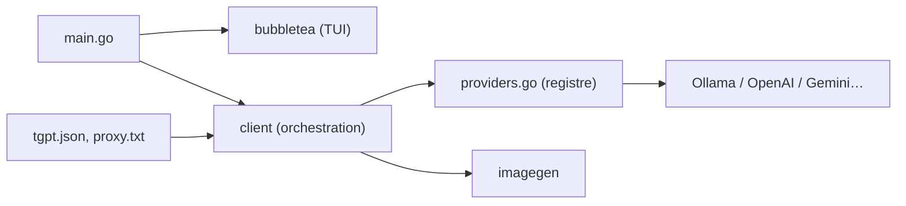

# aandrew-me/tgpt

> Client en ligne de commande pour discuter avec des fournisseurs d'IA depuis le terminal, en Go.

## Le problème
Interroger un modèle sans quitter le shell ni ouvrir un navigateur.

## Ce que ça fait vraiment
Binaire Go multi-plateforme. Le README n'a conservé que l'installation, la mise à jour et le proxy ; la liste des fournisseurs (« Currently available providers ») est vide dans le texte fourni. L'architecture d'après le code montre un registre de fournisseurs (DeepSeek, DuckDuckGo, Gemini, Groq, Kimi, Ollama, OpenAI, Phind, Pollinations…), une couche TUI bubbletea et un module de génération d'images. Les clés API et le coût par fournisseur ne sont pas documentés dans ce README.

## Comment c'est branché


## Essayer
```bash
curl -sSL https://raw.githubusercontent.com/aandrew-me/tgpt/main/install | bash -s /usr/local/bin
brew install tgpt
go install github.com/aandrew-me/tgpt/v2@latest
tgpt -u
```

## Coût et pièges
Gratuit côté outil. Le script d'installation est exécuté via `curl | bash`. Le README ne dit rien sur les conditions d'usage des fournisseurs, ni sur la confidentialité des prompts.

## Ce que ce n'est pas
Pas un modèle ni un agent : un simple relais vers des services tiers dont la disponibilité n'est pas garantie.

## Alternatives
Non documenté dans le README.

## Pour toi
Ignorer : tu as déjà Claude Code et les API directes ; un relais multi-fournisseurs sans doc sur les clés ni les données apporte peu.
