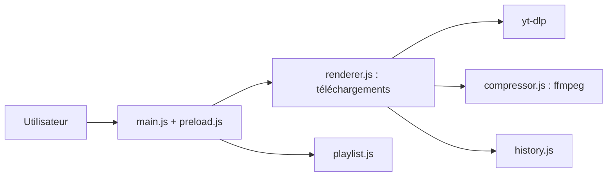

# aandrew-me/ytDownloader

> Application de bureau Electron pour télécharger vidéo et audio depuis des centaines de sites.

## Le problème
Télécharger des vidéos, playlists ou pistes audio avec yt-dlp en ligne de commande est peu pratique pour un non-technicien.

## Ce que ça fait vraiment
Interface graphique au-dessus de yt-dlp et ffmpeg : téléchargement simple ou par playlist, choix de format, plage de temps, sous-titres, compresseur vidéo avec accélération matérielle, historique et préférences. Installation par Microsoft Store, Chocolatey, Scoop, Winget, Flatpak, AppImage ou Snap. Pas de traqueurs ni de publicités selon le README.

## Comment c'est branché


## Essayer
```bash
flatpak install flathub io.github.aandrew_me.ytdn
winget install aandrew-me.ytDownloader
git clone https://github.com/aandrew-me/ytDownloader.git
cd ytDownloader
npm i
npm start
```

## Coût et pièges
Gratuit. Sur macOS, l'app n'est pas signée (commande `xattr` requise) et `yt-dlp` doit être installé via Homebrew. Pour la compilation, il faut déposer ffmpeg à la racine.

## Ce que ce n'est pas
C'est une interface, pas un moteur : les sites pris en charge dépendent de yt-dlp. Le téléchargement de contenus protégés relève du droit local.

## Alternatives
- Aucune alternative nommée dans le README.

## Pour toi
À surveiller : commode pour constituer un petit corpus audio/vidéo local, mais yt-dlp en script est plus automatisable.

