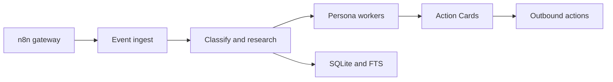

# aayushch/laya

> Centre de commande local qui agrège les notifications de travail et prépare des cartes d'action approuvables par LLM.

## Le problème
Notifications Slack, Gmail, GitHub, Jira, Notion et calendrier arrivent en vrac ; répondre demande de rechercher le contexte à chaque fois.

## Ce que ça fait vraiment
Une appli de bureau Tauri/Svelte pilote un moteur Python FastAPI. n8n normalise les événements, le moteur les classe, fait des recherches via des personas LLM (ingénieur, comms, ops…) et propose des cartes d'action. Après approbation, n8n exécute (PR, réponses). Stockage SQLite et ChromaDB, LLM via LiteLLM (Ollama, LM Studio, Claude, GPT, Gemini) ou agents CLI. Apprentissage de règles, budgets de coûts, recherche hybride.

## Comment c'est branché


## Essayer
```bash
scripts/setup-dev.sh
scripts/dev.sh
scripts/build.sh
```

## Coût et pièges
Les versions installables sont sur la page Releases ; le LLM cloud se paie à l'usage (plafonds mensuels disponibles). Windows ARM et certains Linux demandent des contournements documentés (AppImage, npm 12). Ne pas faire `pip install laya` : c'est un autre paquet.

## Ce que ce n'est pas
Pas un simple agrégateur passif : il peut envoyer des messages et des PR après ton accord. Un README riche, mais peu de preuves de robustesse à long terme.

## Alternatives
Aucune alternative nommée dans le README.

## Pour toi
Surveiller : bonne architecture locale-first avec LLM locaux possibles, mais projet jeune (créé en mai 2026) et beaucoup de connecteurs à configurer.
