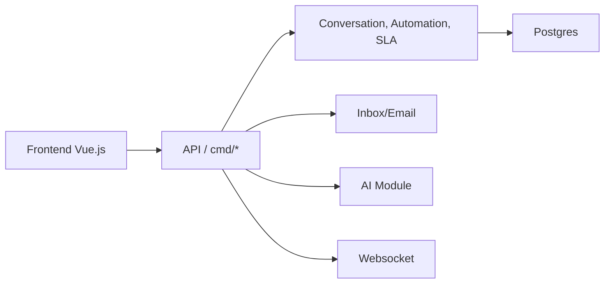

# abhinavxd/libredesk

> Service client auto-hébergé en un binaire : boîte de réception email et chat, base de connaissances, IA.

## Le problème
Centraliser emails et chats clients dans une boîte partagée sans payer un SaaS de support.

## Ce que ça fait vraiment
Backend Go et frontend Vue 3 (Shadcn), PostgreSQL et Redis. Boîte omnicanale, widget de chat, centre d'aide multilingue, assistant IA appuyé sur la base de connaissances avec passage à un humain, copilote d'agent, automatisations, macros, SLA, CSAT, SSO (Google, Microsoft, OIDC), API et webhooks, journaux d'activité.

## Comment c'est branché


## Essayer
```bash
curl -LO https://github.com/abhinavxd/libredesk/raw/main/docker-compose.yml
curl -LO https://github.com/abhinavxd/libredesk/raw/main/config.sample.toml
cp config.sample.toml config.toml
docker compose up -d
docker exec -it libredesk_app ./libredesk --set-system-user-password
```

## Coût et pièges
Gratuit ; Postgres et Redis à fournir (Railway le fait en un clic). Le fournisseur de l'assistant IA n'est pas précisé dans le README. AGPL-3.0. 90 issues ouvertes.

## Ce que ce n'est pas
Pas un outil data/IA : un help desk, dont l'assistant n'est qu'une option.

## Alternatives
Non documenté dans le README.

## Pour toi
Ignorer : domaine du support client sans lien avec ton travail, et un seul mainteneur.
