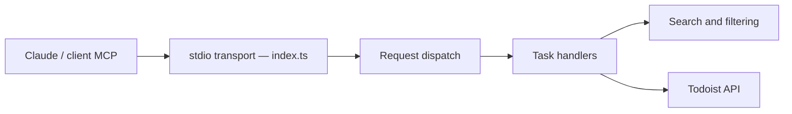

# abhiz123/todoist-mcp-server

> Serveur MCP qui permet à Claude de créer, chercher, modifier et supprimer des tâches Todoist.

## Le problème
Gérer ses tâches Todoist depuis une conversation avec Claude n'est pas possible sans intégration.

## Ce que ça fait vraiment
Un serveur MCP (stdio, un seul fichier `index.ts`) expose cinq outils : création, lecture avec filtres (date, priorité, projet), mise à jour, complétion et suppression. Pour les trois derniers, il retrouve la tâche par correspondance partielle du nom, puis appelle l'API Todoist.

## Comment c'est branché


## Essayer
```bash
npm install -g @abhiz123/todoist-mcp-server
npx -y @smithery/cli install @abhiz123/todoist-mcp-server --client claude
```
Puis ajouter le serveur dans `claude_desktop_config.json` avec `TODOIST_API_TOKEN`.

## Coût et pièges
Gratuit ; nécessite un compte Todoist et son jeton d'API. Dernier push en avril 2025 : plus d'un an d'ancienneté.

## Ce que ce n'est pas
La correspondance par nom partiel peut viser la mauvaise tâche avant suppression ou complétion. Pas de gestion de projets ou d'étiquettes documentée au-delà des filtres.

## Alternatives
Aucune alternative nommée dans le README.

## Pour toi
À surveiller : simple et lisible comme exemple de serveur MCP, mais peu maintenu ; relis-le avant de lui confier ton jeton.

