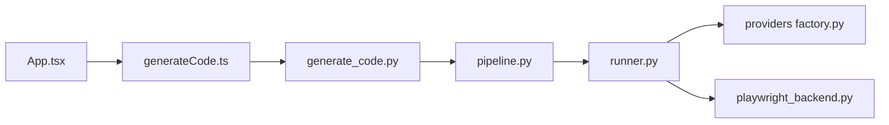

# abi/screenshot-to-code

> Transforme une capture d'écran, une maquette ou un enregistrement en code web, à héberger soi-même.

## Le problème
Recréer à la main en HTML, React ou Vue une interface vue sur une image prend du temps de première mise en page.

## Ce que ça fait vraiment
Une application React/Vite (frontend) et FastAPI (backend) envoie l'image à un modèle (OpenAI, Anthropic ou Gemini) et renvoie du code pour HTML+Tailwind, React, Vue, Bootstrap ou Ionic. Un agent boucle avec des outils, peut rendre la page dans Chromium (Playwright) pour se relire, et Replicate sert à générer ou éditer des images. Un suivi des coûts et des évaluations existe côté backend.

## Comment c'est branché


## Essayer
```bash
cd backend
echo "OPENAI_API_KEY=sk-your-key" > .env
poetry install
poetry run uvicorn main:app --reload --port 7001
cd ../frontend
pnpm install
pnpm dev
```

## Coût et pièges
Au moins une clé d'API (OpenAI, Anthropic ou Gemini) ; Gemini et Replicate recommandés. Chaque génération est facturée par le fournisseur. Version Docker : `docker-compose up -d --build`, sans rechargement à chaud.

## Ce que ce n'est pas
Ce n'est pas une génération hors ligne : Ollama est mentionné mais déconseillé (résultats médiocres). Une version hébergée officielle existe.

## Alternatives
Aucune alternative nommée dans le README (produit hébergé officiel : screenshottocode.com).

## Pour toi
Surveiller : utile comme exemple d'agent multimodal avec évaluations, mais hors de ton cœur de métier et payant à l'usage.

