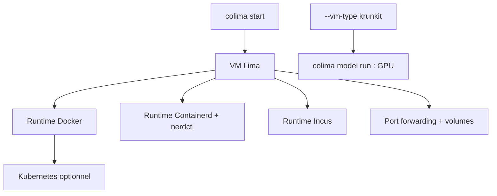

# abiosoft/colima

> Runtimes de conteneurs sur macOS et Linux, avec une VM Lima et une configuration minimale.

## Le problème
Faire tourner Docker sur macOS suppose une VM, du port forwarding et des montages de volumes à configurer.
Basculer entre Docker, containerd et Kubernetes local demande normalement trois outils différents.

## Ce que ça fait vraiment
Démarre une VM Lima préconfigurée exposant un runtime de conteneurs, avec port forwarding automatique, montages de volumes et instances multiples.
Runtimes au choix : Docker (avec Kubernetes optionnel), Containerd (avec Kubernetes optionnel), Incus pour conteneurs et machines virtuelles.
`colima start --kubernetes` donne un cluster local ; les images construites ou récupérées avec Docker y sont accessibles directement (en Containerd, via le namespace `k8s.io`).
Conteneurs accélérés par GPU pour charges IA avec le type de VM `krunkit` (Apple Silicon, macOS 13+), et `colima model run` derrière Docker Model Runner ou Ramalama (registres Docker AI, HuggingFace, Ollama).

## Comment c'est branché


## Essayer
```sh
brew install colima
colima start
docker run hello-world
colima start --runtime containerd
colima start --cpu 4 --memory 8
colima start --runtime docker --vm-type krunkit
colima model run gemma3
```

## Coût et pièges
Gratuit. La VM par défaut fait 2 CPU, 2 GiB de mémoire et 100 GiB de stockage : à augmenter pour un usage sérieux (le disque peut grandir après création, pas rétrécir).
Le client (`docker`, `kubectl`, `incus`, `krunkit`) n'est pas fourni : à installer séparément.

## Ce que ce n'est pas
Ce n'est pas un moteur de conteneurs : c'est une couche de mise en route au-dessus de Lima et des runtimes existants.
Ce n'est pas une interface graphique : tout passe par la CLI et un fichier de configuration.
Les machines virtuelles Incus ne fonctionnent que sur Apple Silicon m3 ou plus récent.

## Alternatives
- Lima — la brique sous-jacente ; Colima n'en est que la mise en route orientée conteneurs.

## Pour toi
La façon la plus simple d'avoir Docker et un Kubernetes local sur un Mac, GPU compris pour les modèles.
