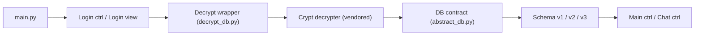

# absadiki/whatsapp-msgstore-viewer

> Application de bureau qui déchiffre et affiche la base WhatsApp msgstore.db, pour usage personnel.

## Le problème
Lire l'historique de conversations WhatsApp sauvegardé demande de déchiffrer la base puis de la parcourir.

## Ce que ça fait vraiment
Interface Kivy en MVC (écrans de connexion, liste, conversation). Le module de déchiffrement embarque un décrypteur tiers pour crypt12/14/15 ; il écrit une copie `-decrypted.db`. Les schémas de base sont des plugins versionnés (`dbs/v1` à `v3`) ; wa.db et le dossier de médias sont optionnels.

## Comment c'est branché


## Essayer
```bash
git clone https://github.com/absadiki/whatsapp-msgstore-viewer
cd whatsapp-msgstore-viewer
pip install -e .
wmv
```

## Coût et pièges
Python 3.9+ ; dépendances système possibles sous Ubuntu. Il faut posséder la base et la clé de déchiffrement. Rétro-ingénierie testée sur la base de l'auteur : un changement de schéma WhatsApp peut casser l'outil.

## Ce que ce n'est pas
Pas endossé par WhatsApp ; « usage personnel et éducatif ». Ne sert pas à récupérer la clé ni les bases (renvoi à un tutoriel externe).

## Alternatives
Aucune alternative citée dans le README.

## Pour toi
À ignorer : outil de lecture de données personnelles, hors sujet pour le travail data / IA, sous GPL-3.0 et tenu par une personne.
