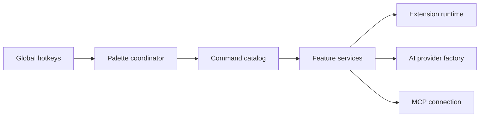

# abue-ammar/tinycast

> Lanceur macOS natif en Swift, façon Raycast, qui exécute aussi de vraies extensions Raycast.

## Le problème
Les lanceurs de commandes riches sont lourds (Electron) ou fermés.

## Ce que ça fait vraiment
Une palette à raccourci global : lancement d'apps, recherche de fichiers (Spotlight), historique du presse-papiers, calculatrice/conversions, snippets, gestion de fenêtres (34 actions), notes Markdown, agenda, raccourcis Apple, commandes shell. Le chat IA et les actions rapides sont désactivés par défaut et utilisent votre clé ou un compte. Exécute des extensions Raycast via un runtime JavaScript embarqué et rend en SwiftUI. Serveurs MCP pris en charge.

## Comment c'est branché


## Essayer
```bash
brew trust --tap abue-ammar/tinycast
brew tap abue-ammar/tinycast
brew install --cask tinycast
```

## Coût et pièges
Gratuit, macOS 26+ uniquement, application auto-signée (drapeau de quarantaine à retirer si installé par DMG). Accessibilité requise pour coller et développer les snippets. Dépôt créé en juin 2026 : très jeune.

## Ce que ce n'est pas
Pas un clone complet de Raycast ; compatibilité d'extensions annoncée mais non mesurée ici. Le badge indique AGPL-3.0, mais GitHub ne l'identifie pas.

## Alternatives
Aucune nommée dans le README (Raycast et Rectangle cités comme références).

## Pour toi
À surveiller : intéressant pour un poste Mac de développeur, mais projet neuf porté par une personne.

