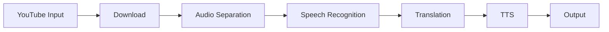

# abus-aikorea/voice-pro

> WebUI Gradio de doublage : téléchargement YouTube, transcription, traduction, clonage de voix.

## Le problème
Sous-titrer, traduire et doubler une vidéo demande plusieurs outils ou un SaaS facturé à la minute.

## Ce que ça fait vraiment
Téléchargement via yt-dlp, séparation de voix (Demucs), transcription Whisper/Faster-Whisper.
Traduction Deep-Translator (ou Azure avec tes clés), synthèse Edge-TTS, kokoro, clonage zero-shot F5-TTS, E2-TTS, CosyVoice.
Onglets Dubbing Studio, Whisper Caption, Translate, Speech Generation ; traduction en direct.

## Comment c'est branché


## Essayer
```bash
git clone https://github.com/abus-aikorea/voice-pro.git
```

## Coût et pièges
Gratuit ; GPU NVIDIA 4 Go+ (8 Go conseillé), ~10 Go de modèles, 20 Go de disque. Azure optionnel à ta charge.

## Ce que ce n'est pas
Développement en pause (équipe sur WeConnect). Licence incohérente : GPL-3.0 au catalogue, LGPL dans l'en-tête. Voix de célébrités proposées : risque juridique.

## Alternatives
Plateformes SaaS listées (Maestra, Kapwing, HappyScribe, Descript…), non des dépôts : aucune alternative de dépôt nommée.

## Pour toi
À ignorer : outil de bout en bout non maintenu ; les briques Whisper/F5-TTS s'utilisent mieux directement.
