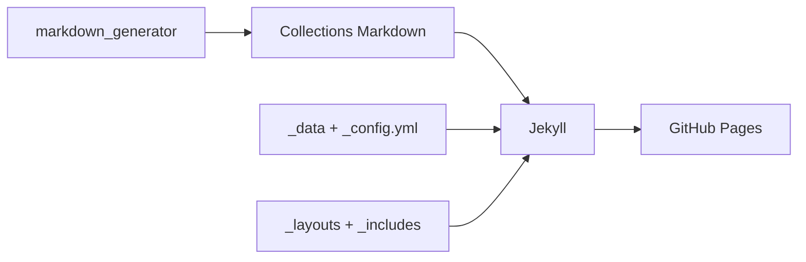

# academicpages/academicpages.github.io

> Modèle Jekyll pour site personnel académique hébergé sur GitHub Pages : publications, exposés, CV.

## Le problème
Un chercheur veut un site de portfolio simple, versionné et gratuit, sans repartir d'une page blanche.

## Ce que ça fait vraiment
Modèle GitHub (« Use this template ») issu du thème Minimal Mistakes. Le contenu est en Markdown dans des collections (`_publications`, `_talks`, `_teaching`, `_portfolio`, `_posts`), la configuration dans `_config.yml` et `_data/`. Des scripts Python et notebooks de `markdown_generator/` produisent les pages à partir d'un fichier TSV ou BibTeX ; d'autres convertissent un CV Markdown en JSON. Aperçu local avec Jekyll, Docker ou DevContainer.

## Comment c'est branché


## Essayer
```bash
bundle install
jekyll serve -l -H localhost
docker compose up
```

## Coût et pièges
Gratuit. Il faut Ruby, Bundler et Node en local, ou Docker. Le README prévient que synchroniser un site personnalisé avec les mises à jour du modèle provoque des conflits.

## Ce que ce n'est pas
Ce n'est pas un CMS ni un outil de publication de résultats de recherche : c'est un site statique.

## Alternatives
Le README cite Minimal Mistakes, le thème dont il est issu.

## Pour toi
À surveiller : pratique pour un portfolio de projets data ou un blog technique gratuit, à condition d'accepter Ruby/Jekyll.

