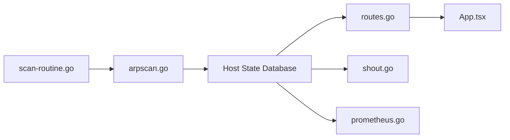

# aceberg/WatchYourLAN

> Scanner ARP de réseau local avec interface web, historique des hôtes et alertes.

## Le problème
Savoir quels appareils se connectent à son réseau et être prévenu quand un nouveau arrive.

## Ce que ça fait vraiment
Il lance `arp-scan` à intervalle régulier sur les interfaces choisies et garde la liste et l'historique des hôtes (SQLite ou Postgres).
Notifications via Shoutrrr (Discord, Telegram, Gotify…).
Export vers InfluxDB2 ou un endpoint Prometheus `/metrics` pour Grafana.
Interface web sur le port 8840, sans authentification intégrée.

## Comment c'est branché


## Essayer
```bash
docker run --name wyl -e "IFACES=$YOURIFACE" -e "TZ=$YOURTIMEZONE" --network="host" -v $DOCKERDATAPATH/wyl:/data/WatchYourLAN aceberg/watchyourlan
```

## Coût et pièges
Le mode réseau `host` est obligatoire, donc le port est exposé : il faut le protéger soi-même par pare-feu ou SSO.

## Ce que ce n'est pas
Pas un outil de sécurité ou d'IDS, et pas d'authentification intégrée.

## Alternatives
Aucune alternative nommée dans le README.

## Pour toi
À ignorer : c'est un outil de homelab sans rapport avec la data ou l'IA, et le dernier push date de plus d'un an.
