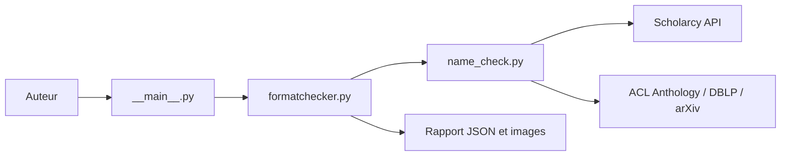

# acl-org/aclpubcheck

> Vérifie le format PDF d'un article ACL (marges, polices, auteurs, citations) avant soumission.

## Le problème
Les articles mal formatés coûtent des échanges avec les responsables des publications et distraient les relecteurs.

## Ce que ça fait vraiment
Analyse un PDF au style LaTeX ACL : marges, numérotation de pages, polices, références. Il écrit un rapport JSON et des images annotées. La vérification de citations extrait la bibliographie via l'API Scholarcy et la compare à ACL Anthology, DBLP et arXiv. Des outils pour chairs valident les métadonnées contre des feuilles Google Sheets.

## Comment c'est branché


## Essayer
```bash
uvx --from git+https://github.com/acl-org/aclpubcheck aclpubcheck --paper_type PAPER_TYPE /path/to/paper.pdf
python3 -m aclpubcheck -p long example/2023.acl-tutorials.1.pdf
```

## Coût et pièges
Python 3.10+. À lancer sur la version camera-ready, pas sur la version à numéros de ligne. Les alertes de citation peuvent être fausses ; le contrôle utilise des services externes.

## Ce que ce n'est pas
Ne juge pas le contenu scientifique, seulement la forme.

## Alternatives
Une version Colab et un Space Hugging Face (teelinsan/aclpubcheck) évitent l'installation locale ; rebiber corrige les fichiers bib.

## Pour toi
À adopter si tu publies à ACL/NAACL : gratuit, maintenu, utilisé par les chairs, il évite des allers-retours inutiles.

