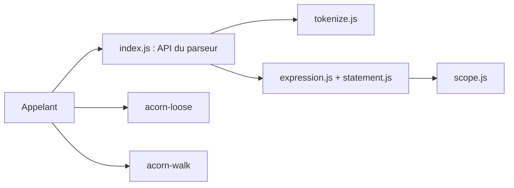

# acornjs/acorn

> Petit parseur JavaScript écrit en JavaScript, avec variante tolérante aux erreurs et parcours d'AST.

## Le problème
Les outils qui analysent ou transforment du JavaScript ont besoin d'un AST fiable, léger et extensible.

## Ce que ça fait vraiment
Le dépôt contient trois paquets : `acorn` (parseur strict), `acorn-loose` (parseur tolérant aux erreurs) et `acorn-walk` (parcours d'arbre ESTree). Le système de plugins permet d'étendre le parseur (JSX, bigint) via `Parser.extend`, au prix d'une dépendance aux internes.

## Comment c'est branché


## Essayer
```bash
git clone https://github.com/acornjs/acorn.git
cd acorn
npm install
```

## Coût et pièges
Gratuit. Le catalogue indique aucune licence détectée sur le dépôt : à vérifier avant tout usage. Les plugins cassent quand les internes changent.

## Ce que ce n'est pas
Pas un minifieur ni un transpileur : il ne produit que l'arbre. L'API des plugins est décrite comme « pas propre ni élégante ».

## Alternatives
- Aucune alternative nommée dans le README.

## Pour toi
À surveiller : brique de base si tu analyses du code JavaScript (par ex. pour des agents de code), mais à vérifier côté licence.

