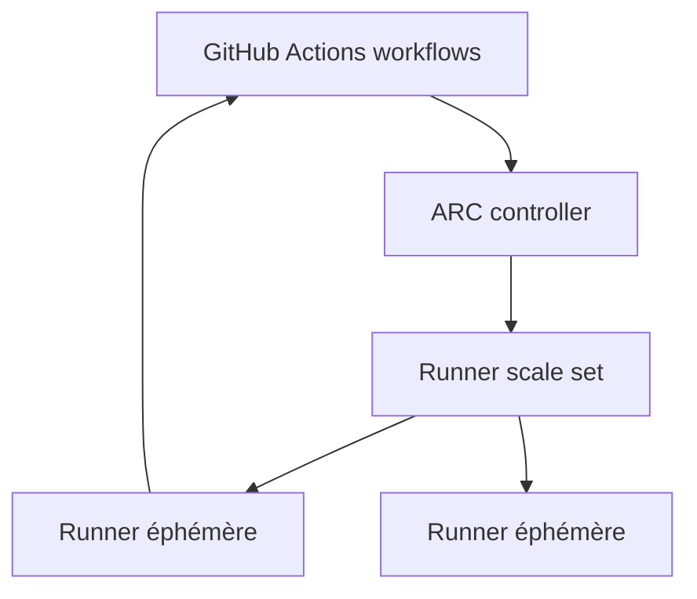

# actions/actions-runner-controller

> Opérateur Kubernetes qui orchestre et scale des runners self-hosted GitHub Actions.

## Le problème
Faire tourner des runners GitHub Actions self-hosted à l'échelle demande de les créer, scaler et nettoyer manuellement. Les runners persistants sont lents à recycler.

## Ce que ça fait vraiment
Crée des « runner scale sets » qui scalent automatiquement selon le nombre de workflows en cours (repo, org ou entreprise). Runners éphémères basés conteneurs : montée/descente rapide et propre. Installation via Helm. Développé avec l'équipe GitHub Actions ; les anciens modes d'autoscaling sont legacy et maintenus par la communauté.

## Comment c'est branché

## Essayer
Aucune commande d'installation dans le README (renvoie vers le Quickstart guide via Helm). L'écrire : voir le Quickstart sur docs.github.com.

## Coût et pièges
Gratuit. Nécessite un cluster Kubernetes, Helm et un compte GitHub avec authentification à l'API. Modes d'autoscaling legacy maintenus par la communauté seulement.

## Ce que ce n'est pas
Pas un runner : c'est l'orchestrateur qui les provisionne. Pas pour d'autres CI que GitHub Actions.

## Alternatives
Non nommées dans le README.

## Pour toi
Utile si ton CI/CD GitHub tourne sur Kubernetes et que tu veux des runners scalables ; hors périmètre data/IA direct.
