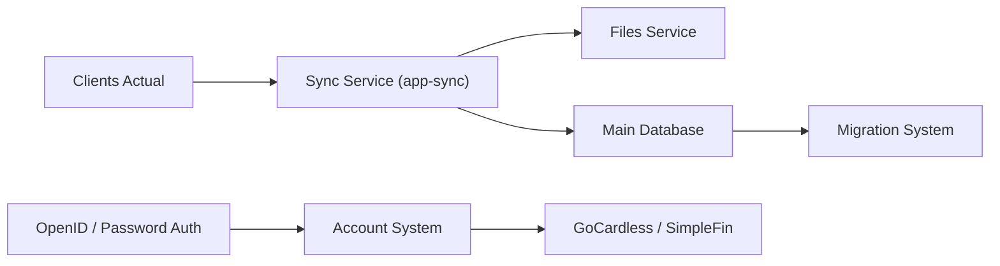

# actualbudget/actual-server

> Ancien serveur de synchronisation d'Actual, outil de finances personnelles local-first, fusionné dans actualbudget/actual.

## Le problème
Un outil de budget local a besoin d'un serveur pour synchroniser les données entre appareils.

## Ce que ça fait vraiment
Le dépôt fournit Actual avec un serveur Node.js de synchronisation. D'après le code : authentification par mot de passe ou OpenID, comptes, synchronisation de fichiers, migrations de base, et connecteurs bancaires GoCardless et SimpleFIN. L'annonce du README dit que le dépôt fusionne dans `actualbudget/actual` en février 2025.

## Comment c'est branché

## Essayer
Aucune commande dans le README : il renvoie à la documentation communautaire pour l'installation.

## Coût et pièges
Gratuit. Les connecteurs bancaires GoCardless et SimpleFIN passent par des services tiers. Le dépôt est archivé : plus de correctifs ici.

## Ce que ce n'est pas
Pas le dépôt actif : le développement se poursuit dans `actualbudget/actual`. Ce n'est pas une appli cloud.

## Alternatives
- actualbudget/actual : dépôt de remplacement où le projet est fusionné.

## Pour toi
À ignorer : archivé, mieux vaut suivre `actualbudget/actual` si la finance personnelle en local t'intéresse.

