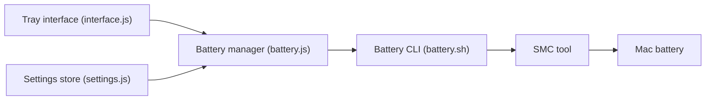

# actuallymentor/battery

> Application de barre de menus et CLI limitant la charge des MacBook Apple Silicon (par ex. à 80 %).

## Le problème
Garder la batterie constamment chargée à 100 % branchée l'use plus vite.

## Ce que ça fait vraiment
Désactive la charge au-dessus d'un seuil, la réactive en dessous, et persiste après redémarrage. Utilise l'outil `smc`. CLI : `maintain`, `charging`, `adapter`, `calibrate`, `charge`, `discharge`, `status`. L'application GUI (Electron) gère l'installation du CLI.

## Comment c'est branché


## Essayer
```bash
brew install battery
curl -s https://raw.githubusercontent.com/actuallymentor/battery/main/setup.sh | bash
battery maintain 80
```

## Coût et pièges
Gratuit. Mot de passe administrateur demandé à l'installation. Apple Silicon uniquement. Appelle des URL externes : analytique d'installation (adresses IP uniques), icanhazip.com, GitHub, electronjs.org.

## Ce que ce n'est pas
Pas compatible Intel. Le README renvoie vers un article sur l'efficacité réelle du plafonnement.

## Alternatives
- Al Dente : version gratuite pour Mac Intel, version premium plus complète.
- Optimized Charging (macOS) : fonction native, pilotée par apprentissage automatique.

## Pour toi
À ignorer pour la veille pro : utilitaire de confort pour portable Mac, avec des privilèges élevés et de la télémétrie.

