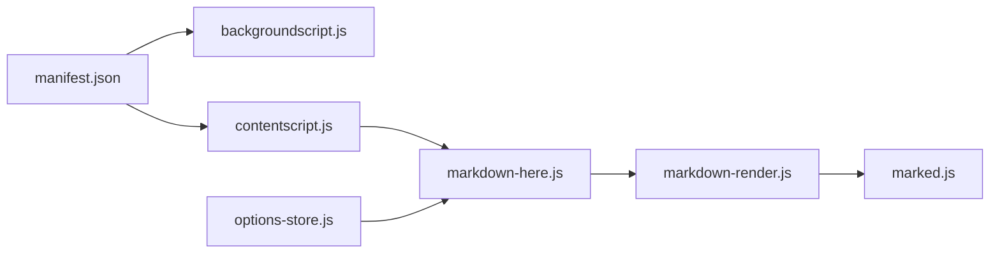

# adam-p/markdown-here

> Extension de navigateur qui convertit du Markdown en courriel enrichi avant l'envoi.

## Le problème
Écrire un courriel avec du code et de la mise en forme dans un éditeur riche est fastidieux, alors que le Markdown est rapide.

## Ce que ça fait vraiment
L'extension (Chrome, Firefox, Opera, Thunderbird) ajoute une bascule « Markdown Toggle » (menu, bouton ou raccourci Maj+Alt+M) qui rend le texte en HTML avec coloration syntaxique, formules TeX, et permet de revenir au Markdown. Rendu local (marked, highlight.js), options synchronisées par le navigateur.

## Comment c'est branché


## Essayer
```bash
cd utils
node build.js
```

## Coût et pièges
Gratuit. Le dernier push (2025-08-22) date de plus d'un an. Mozilla met jusqu'à un mois à valider les changements Firefox.

## Ce que ce n'est pas
Ce n'est pas un client mail ; il dépend de l'éditeur riche des webmails (Gmail, Hotmail, Yahoo, Thunderbird).

## Alternatives
Aucune alternative nommée dans le README.

## Pour toi
Ignorer : l'usage est marginal pour un profil data, et le projet ne bouge plus depuis plus d'un an.

