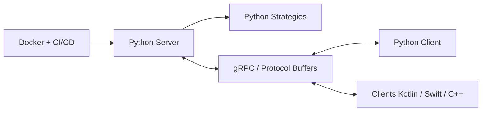

# adap/flower

> Framework d'apprentissage fédéré indépendant du framework de ML, pour chercheurs et ingénieurs.

## Le problème
Entraîner un modèle sur des données réparties (hôpitaux, appareils) sans les centraliser.

## Ce que ça fait vraiment
Flower (`flwr`) orchestre un serveur qui agrège les mises à jour de clients selon une stratégie (FedAvg, FedProx, FedOpt, etc.). Il fonctionne avec PyTorch, TensorFlow, JAX, scikit-learn, Hugging Face, XGBoost, MLX et d'autres, et propose des clients Python, C/C++, Kotlin, Swift. La communication passe par gRPC. Des baselines reproduisent des publications ; tutoriels et exemples couvrent la mise au point fédérée de LLM.

## Comment c'est branché

## Essayer
Le README ne fournit pas de commande d'installation : il renvoie à la page Installation et aux quickstarts par framework.

## Coût et pièges
Gratuit. Il faut concevoir le déploiement réseau des clients et la gestion de la confidentialité ; les tutoriels sur la vie privée sont annoncés « à venir ».

## Ce que ce n'est pas
Pas une garantie de confidentialité en soi : l'apprentissage fédéré ne suffit pas sans mesures additionnelles (exemple Opacus mentionné).

## Alternatives
Aucune alternative nommée dans le README.

## Pour toi
À adopter si tu travailles sur des données non centralisables : projet actif, large support de frameworks et de nombreux exemples.
