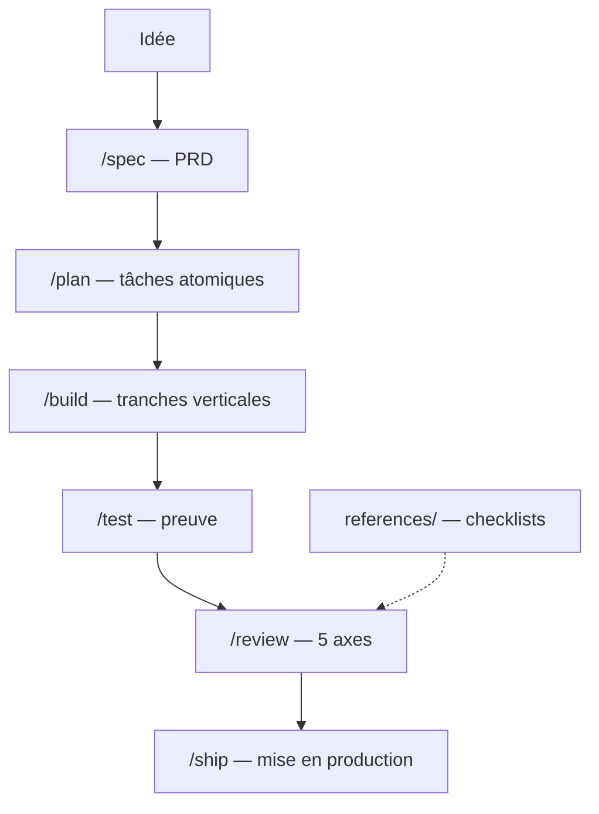

# addyosmani/agent-skills

> Vingt-cinq skills Markdown qui imposent à un agent de code un cycle de développement discipliné.

## Le problème
Un agent prend le chemin le plus court : pas de spec, pas de test, pas de revue de sécurité.
Rappeler la méthode à chaque prompt ne tient pas sur la durée d'un projet.

## Ce que ça fait vraiment
Neuf commandes calées sur le cycle : `/spec`, `/plan`, `/build`, `/test`, `/constraints`, `/review`, `/webperf`, `/code-simplify`, `/ship`.
Chaque skill a la même anatomie : processus, table d'anti-rationalisation, drapeaux rouges, exigences de preuve.
Quatre personas de revue (code, tests, sécurité, performance web) et sept listes de contrôle partagées.
`/build auto` enchaîne plan et implémentation en une passe approuvée, en commitant tâche par tâche.

## Comment c'est branché


## Essayer
```bash
npx skills add addyosmani/agent-skills --list
npx skills add addyosmani/agent-skills
npx skills add addyosmani/agent-skills --skill code-review-and-quality
```

## Coût et pièges
Gratuit, du Markdown pur. Les skills sont du contexte permanent : elles consomment des tokens à chaque tour.
Une installation d'une seule skill ne copie pas `references/`, donc les checklists partagées manquent (issue #361).

## Ce que ce n'est pas
Pas un outil : rien ne s'exécute, rien ne vérifie — ce sont des consignes que l'agent peut ignorer.
Pas spécifique à un langage ni à la data ; les exemples de tests sont JavaScript/TypeScript.
Le marketplace Claude Code clone en SSH, ce qui casse sans clé configurée.

## Alternatives
- `github/spec-kit` : même intention, plus prescriptif, avec des artefacts sur disque.
- `DietrichGebert/ponytail` : une seule règle, beaucoup moins de contexte consommé.

## Pour toi
Le pack le plus lisible du lot, et on peut n'en prendre que deux ou trois skills. À adopter au détail.
