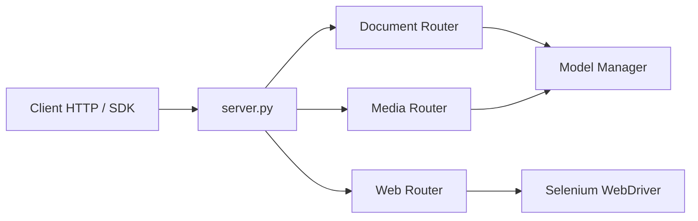

# adithya-s-k/omniparse

> Serveur local qui convertit documents, médias et pages web en Markdown pour les LLM.

## Le problème
Préparer des PDF, vidéos, audios et pages web pour du RAG demande un outil différent par format.

## Ce que ça fait vraiment
Une API FastAPI avec des routes `/parse_document`, `/parse_media`, `/parse_image`, `/parse_website`.
Des modèles Surya OCR et Florence-2 pour les documents, Whisper pour l'audio et la vidéo, Selenium pour le web.
Les flags `--documents --media --web` choisissent les modèles chargés en GPU.
Tout tourne en local, sans base de données.

## Comment c'est branché


## Essayer
```bash
docker pull savatar101/omniparse:0.1
docker run --gpus all -p 8000:8000 savatar101/omniparse:0.1
python server.py --host 0.0.0.0 --port 8000 --documents --media --web
```

## Coût et pièges
Il faut un GPU de 8 à 10 Go de VRAM, et le serveur ne tourne que sous Linux. Les poids Marker/Surya sont en cc-by-nc-sa, avec restrictions au-delà de 5 M$ de revenus.

## Ce que ce n'est pas
Pas fiable sur les équations, les tableaux ou le chinois. Les plus petits modèles sont utilisés pour tenir en mémoire.

## Alternatives
- Marker : le parseur PDF sous-jacent, si seuls les PDF comptent.

## Pour toi
À surveiller : l'API d'ingestion multimodale est pratique pour un POC RAG, mais les licences des poids et la faible précision rendent l'usage en production risqué.
