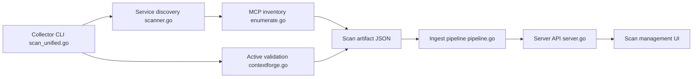

# adithyan-ak/AgentHound

> Framework d'évaluation de sécurité offensive pour l'infrastructure d'agents IA (MCP, A2A, passerelles, bases vectorielles), pour équipes red team autorisées.

## Le problème
Les infrastructures d'agents (serveurs MCP, passerelles de modèles, notebooks, stores vectoriels) accumulent des secrets et des accès difficiles à cartographier. Les évaluer à la main est long.

## Ce que ça fait vraiment
Un collecteur Go statique inventorie les configurations d'agents locales (Claude Code, Cursor, etc.), découvre et identifie les services IA joignables, teste la réutilisation des identifiants trouvés et écrit un artefact JSON checkpointé. Il peut aussi valider des accès par des actions réversibles. Un serveur optionnel ingère l'artefact, construit un graphe de chemins (accès, exécution, exfiltration, empoisonnement d'instructions) et l'affiche dans une interface. Le mode `--stealth` se limite à la lecture.

## Comment c'est branché


## Essayer
Uniquement sur des systèmes dont vous êtes propriétaire ou que vous êtes autorisé à évaluer.
```bash
brew install adithyan-ak/agenthound/agenthound
agenthound scan --stealth --output scan.json
agenthound revert scan.json
```

## Coût et pièges
Gratuit ; le serveur d'analyse demande Docker Compose. Le scan par défaut est actif (réutilisation d'identifiants, mutation réversible) ; l'artefact contient les secrets en clair et doit être protégé.

## Ce que ce n'est pas
Ce n'est pas un scanneur passif : sans `--stealth`, il agit sur les cibles. L'usage est légalement encadré par une autorisation écrite. Projet récent (avril 2026), porté par une seule personne.

## Alternatives
Aucune alternative nommée dans le README.

## Pour toi
Surveiller : utile pour auditer avec autorisation ses propres déploiements MCP et passerelles LLM, mais jeune, mono-mainteneur, et à n'utiliser qu'en `--stealth` sur un périmètre autorisé.

