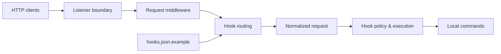

# adnanh/webhook

> Petit serveur Go qui expose des endpoints HTTP déclenchant des commandes locales configurées.

## Le problème
Déclencher un script de redéploiement sur un serveur à chaque push ou commande Slack demande d'écrire un mini-serveur à la main.

## Ce que ça fait vraiment
Lit des hooks en JSON/YAML (`hooks.json`), écoute sur le port 9000, exécute la commande associée à `/hooks/<id>`.
Passe en,-têtes, payload et query en arguments ou variables d'environnement ; règles de déclenchement (secret, IP…).
HTTPS natif, socket Unix derrière reverse proxy, activation systemd, templates Go, en-têtes CORS.
Middleware de logs et d'ID de requête, abandon de privilèges sous Unix.

## Comment c'est branché


## Essayer
```bash
go build github.com/adnanh/webhook
sudo apt-get install webhook
/path/to/webhook -hooks hooks.json -verbose
```

## Coût et pièges
Gratuit ; un hook sans `trigger-rule` permet à quiconque connaît l'URL d'exécuter ta commande.
Derrière un proxy, la règle `ip-whitelist` voit l'IP du proxy.

## Ce que ce n'est pas
Pas une passerelle de webhooks fiable (file, rejeu, monitoring) : il reçoit et exécute, rien de plus.
Support multipart limité.

## Alternatives
Le README renvoie vers deux services non nommés (passerelle de scripts, passerelle d'événements) : aucun dépôt identifiable.

## Pour toi
À adopter pour déclencher simplement un réentraînement ou un redéploiement de modèle depuis un push Git, à condition de poser une règle de secret.
