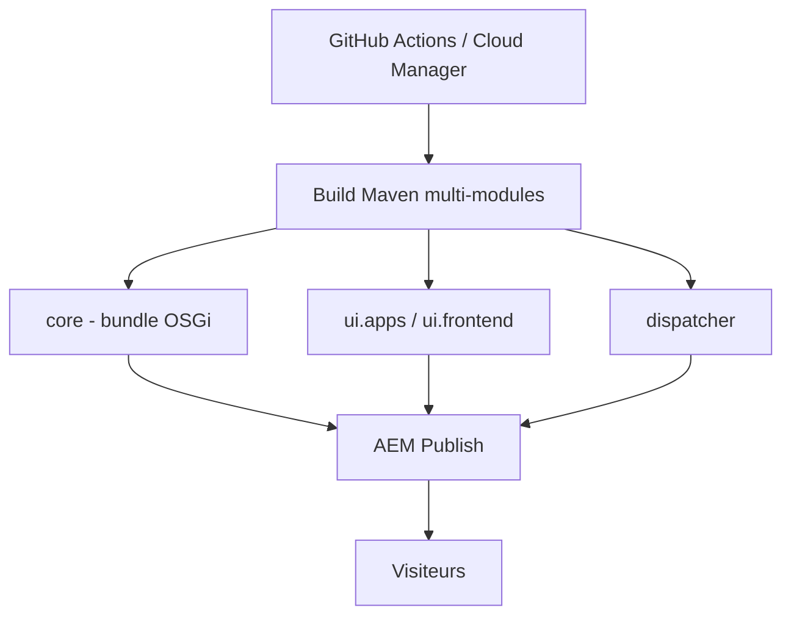

# adobe/aem-guides-wknd

> Site de référence Adobe Experience Manager pour apprendre à bâtir un site complet, destiné aux développeurs AEM.

## Le problème
Apprendre AEM Sites demande un projet complet et réaliste : modules Java, contenu, front, cache Dispatcher, tests.

## Ce que ça fait vraiment
Projet Maven multi-modules pour une marque fictive « WKND » : bundles OSGi (`core`), définitions et scripts HTL (`ui.apps`), configs OSGi (`ui.config`), contenu d'exemple (`ui.content.sample`), front Webpack/Sass/TypeScript (`ui.frontend`), config `dispatcher`, tests d'intégration Java (`it.tests`) et Cypress (`ui.tests`). Se déploie via Cloud Manager ou en local (SDK AEM, AEM 6.5). Java 21 et Maven 3.9.4+ exigés sur `main`.

## Comment c'est branché


## Essayer
```bash
cd aem-guides-wknd/
mvn clean install -PautoInstallSinglePackage
# AEM 6.5.x :
mvn clean install -PautoInstallSinglePackage -Pclassic
```

## Coût et pièges
Il faut une instance AEM (Cloud Service, SDK ou 6.5), produit commercial Adobe. Le contenu d'exemple écrase le contenu édité à chaque build, sauf `mode="merge"` dans `filter.xml`.

## Ce que ce n'est pas
Pas un modèle à copier tel quel : le README dit que embarquer le site complet dans le dépôt est « inhabituel » et déconseillé en vrai projet. Les images Adobe Stock ne sont pas réutilisables librement.

## Alternatives
- AEM Project Archetype : le point de départ dont ce projet est généré.
- AEM Core Components : les composants sur lesquels il s'appuie.

## Pour toi
Ignorer : c'est un tutoriel de CMS Adobe (Java/OSGi), sans rapport avec un travail data, IA ou MLOps.

