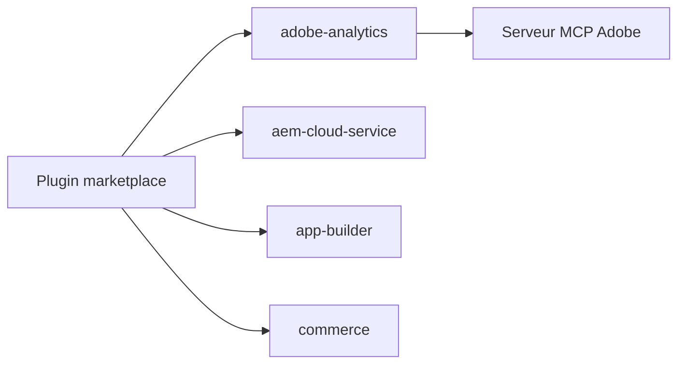

# adobe/skills

> Catalogue de plugins et skills d'Adobe pour agents de code : analytics, AEM, Commerce, Workfront.

## Le problème
Les agents de code connaissent mal les produits Adobe (AEM, App Builder, Commerce) et leurs procédures.

## Ce que ça fait vraiment
Le dépôt propose des plugins installables dans Claude Code, Copilot CLI, Cursor ou via `npx skills`. Les skills analytics (Adobe Analytics, Customer Journey Analytics) interrogent des serveurs MCP Adobe avec authentification IMS : KPI, top movers, entonnoirs, comparaison de segments, synthèses de direction. Le reste couvre AEM Edge Delivery, AEM Cloud Service et 6.5 LTS, App Builder, Commerce, Workfront et la création Adobe.

## Comment c'est branché


## Essayer
```bash
/plugin marketplace add adobe/skills
/plugin install adobe-analytics@adobe-skills
npx skills add adobe/skills --all
```

## Coût et pièges
Les skills analytics exigent un accès Adobe (en-têtes IMS) et les serveurs MCP correspondants. Certains skills nécessitent le Dispatcher MCP ou l'`aio` CLI. Les skills Creativity ne visent que l'application Claude desktop.

## Ce que ce n'est pas
Pas un outil généraliste : tout suppose des produits Adobe sous licence. Ce n'est pas un SDK.

## Alternatives
Aucune alternative nommée dans le README.

## Pour toi
À ignorer sauf si ton entreprise utilise Adobe Analytics ou AEM : les skills analytics sont le seul point d'entrée data, et exigent un accès Adobe.

