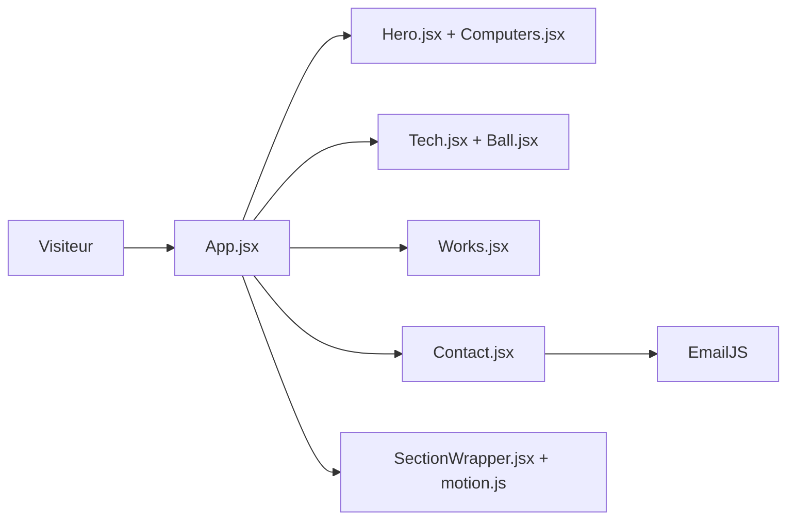

# adrianhajdin/project_3D_developer_portfolio

> Modèle de site portfolio en React avec scènes 3D, code d'un tutoriel vidéo pour développeurs web.

## Le problème
Un portfolio de développeur classique est plat. Partir de zéro pour y mettre du 3D animé demande de maîtriser Three.js et ses wrappers React.

## Ce que ça fait vraiment
Page unique React/Vite avec sections Hero (bureau 3D), About, Experience, Skills (sphères 3D), Works, Feedbacks et Contact (terre 3D, fond d'étoiles). Les animations passent par framer motion, le style par Tailwind. Le formulaire de contact envoie via EmailJS. Les données (projets, expériences, témoignages) sont des constantes à remplacer dans `constants.js`.

## Comment c'est branché


## Essayer
```bash
git clone git@github.com:adrianhajdin/project_3D_developer_portfolio.git
cd project_3D_developer_portfolio
npm install
# créer .env avec REACT_APP_EMAILJS_USERID, _TEMPLATEID, _RECEIVERID
npm run dev
```

## Coût et pièges
Gratuit, mais il faut un compte EmailJS pour le formulaire. Aucune licence n'est déclarée : droits de réutilisation flous. Dernier push en octobre 2024, 124 issues ouvertes.

## Ce que ce n'est pas
Pas une bibliothèque ni un framework : c'est le code d'un tutoriel à forker et à vider. Le contenu fourni (Starbucks, Tesla, témoignages) est fictif. Aucun lien avec la donnée ou l'IA.

## Alternatives
Aucune alternative nommée dans le README.

## Pour toi
Ignorer : un gabarit web 3D sans licence, hors du périmètre data/IA/MLOps ; seul intérêt, apprendre React Three Fiber par le tutoriel.

