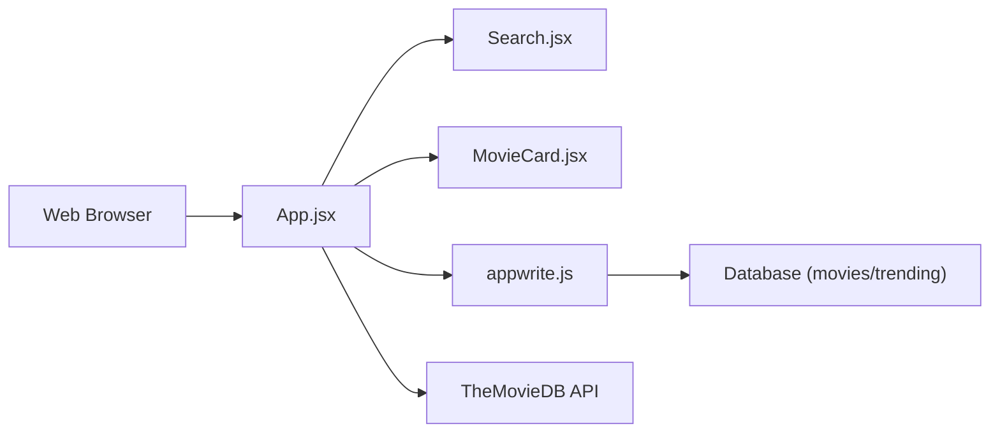

# adrianhajdin/react-movies

> Application React de recherche de films issue d'un tutoriel vidéo, pour débutants en front-end.

## Le problème
Apprendre à assembler React, un backend en service et une API externe sur un projet concret.

## Ce que ça fait vraiment
SPA Vite + React + Tailwind : parcourir et chercher des films via l'API TMDB, avec une liste « tendances » stockée dans Appwrite (base de données). Pas de serveur dans le dépôt. Composants Search, MovieCard, Spinner.

## Comment c'est branché


## Essayer
```bash
git clone https://github.com/adrianhajdin/react-movies.git
cd react-movies
npm install
npm run dev
```
Créer `.env.local` avec `VITE_TMDB_API_KEY` et les trois identifiants Appwrite.

## Coût et pièges
Clé TMDB et projet Appwrite à créer. Aucune licence déclarée : réutilisation juridiquement floue. Dernier push en juin 2025.

## Ce que ce n'est pas
Pas un produit : un support de cours, dont la valeur est dans la vidéo associée.

## Alternatives
Aucune alternative nommée dans le README.

## Pour toi
À ignorer : exercice de front-end sans licence, sans lien avec la donnée ou le MLOps.

