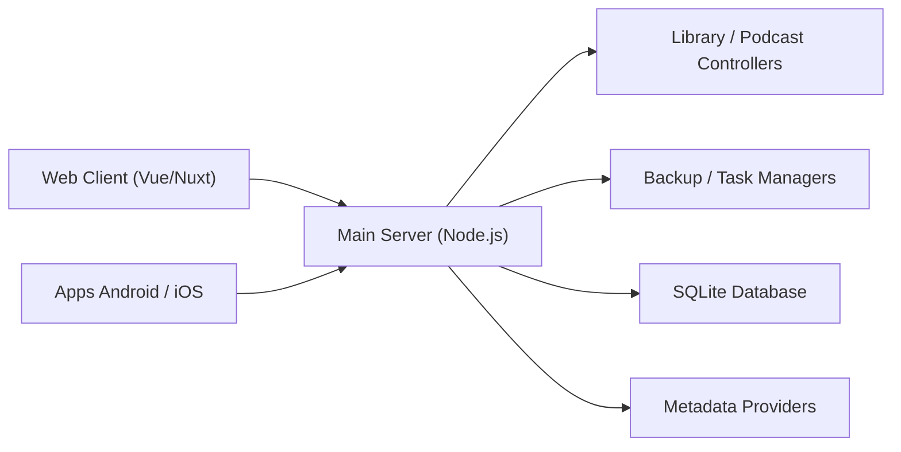

# advplyr/audiobookshelf

> Serveur auto-hébergé de livres audio et de podcasts, avec applications web, Android et iOS.

## Le problème
Écouter sa propre bibliothèque de livres audio et de podcasts avec suivi de progression, sans dépendre d'un service commercial.

## Ce que ça fait vraiment
Un serveur Node.js diffuse les formats audio à la volée, suit la progression par utilisateur et la synchronise entre appareils, détecte les changements de bibliothèque et gère les téléchargements automatiques de podcasts. Il récupère métadonnées et couvertures, édite les chapitres, fusionne des fichiers en m4b, propose une lecture d'ebooks (epub, pdf, cbr, cbz), Chromecast et des sauvegardes automatiques. Base SQLite.

## Comment c'est branché


## Essayer
Le README renvoie à la documentation pour l'installation. Pour développer :
```bash
npm ci
cd client
npm ci
npm run generate
cd ..
npm run dev
```

## Coût et pièges
Gratuit. Le serveur exige une connexion websocket derrière un reverse proxy. Structure de dossiers imposée pour la bibliothèque. Le frontend Vue est en cours de réécriture en React : les PR frontend ne sont plus revues. Applications mobiles en bêta ; bêta iOS complète. 1 190 issues ouvertes ; GPL-3.0.

## Ce que ce n'est pas
Ce n'est pas un service de streaming en ligne ni un catalogue : tu fournis tes propres fichiers audio.

## Alternatives
Le README ne nomme aucune alternative.

## Pour toi
Ignorer : serveur multimédia personnel sans rapport avec data/IA/MLOps ; il reste correct pour un usage domestique, mais avec un frontend en pleine réécriture.

