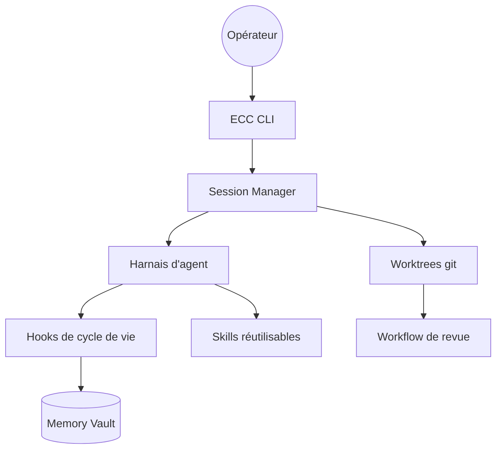

# affaan-m/ECC

> Un paquet d'agents, skills et hooks à installer dans son agent de code, pour développeurs.

## Le problème
Sans lui, chaque prompt redécrit la même discipline : planifier, tester, relire, se souvenir.
Rien ne persiste d'une session à l'autre, et rien n'est réutilisable entre projets.

## Ce que ça fait vraiment
Installe 68 agents, 292 skills, 94 commandes de compatibilité, des hooks, des règles et une mémoire.
Impose une boucle plan → test → implement → review → verify → remember → improve.
Cible principale Claude Code, chemin Codex supporté, adaptateurs limités pour ~12 autres harnais.
Embarque AgentShield, un scanner de prompts, hooks, config MCP, permissions et secrets.

## Comment c'est branché


## Essayer
```bash
npx ecc-universal@2.2.2 setup
npx ecc-universal@2.2.2 doctor
npx ecc-universal@2.2.2 uninstall --dry-run
```

## Coût et pièges
OSS MIT gratuit ; ECC Pro (dépôts privés) à 19 $/siège/mois. Node 18+, Git, Claude Code 2.1+.
Empiler deux méthodes d'installation dans le même harnais duplique skills, hooks et commandes.

## Ce que ce n'est pas
Ce n'est pas un agent : c'est une couche de configuration au-dessus d'un agent existant.
Les commandes `multi-*` exigent un runtime tiers (`ccg-workflow`) que le dépôt ne fournit pas.
La parité entre harnais n'existe pas — lire la matrice de support avant de compter dessus.

## Alternatives
- `addyosmani/agent-skills` : pack plus petit, 25 skills, moins de surface à auditer.
- `DietrichGebert/ponytail` : une seule règle mesurée, au lieu d'un catalogue.

## Pour toi
292 skills installés d'un coup, par un mainteneur unique : trop de surface pour un poste MLOps. À observer.
