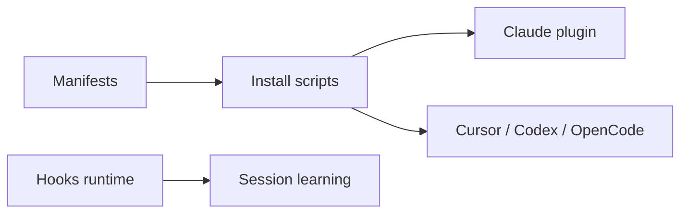

# affaan-m/everything-claude-code

> Système de 68 agents, 292 skills, hooks et règles pour Claude Code, Codex et d'autres harnais.

## Le problème
Un agent oublie TDD, revue et vérification d'une session à l'autre, et on refait ces consignes dans chaque prompt.

## Ce que ça fait vraiment
Un plugin (`ecc@ecc`) et un installeur (`ecc-universal`) déposent agents, skills, commandes, règles et hooks dans le harnais choisi. Hooks pour le formatage et la sécurité, mémoire entre sessions, scan de configuration (AgentShield). Adaptateurs Cursor, OpenCode, Codex, Gemini.

## Comment c'est branché


## Essayer
```bash
npx ecc-universal@2.2.2 setup
npx ecc-universal@2.2.2 install --profile minimal --target claude
npx ecc-universal@2.2.2 doctor
```

## Coût et pièges
Node 18+. Les règles sont toujours chargées : elles consomment du contexte. Ne pas empiler plusieurs méthodes d'installation. Le README parle d'une offre payante (ECC Pro, dès 19 $/siège/mois).

## Ce que ce n'est pas
Pas un produit neutre : 292 skills, dont beaucoup hors data/IA. Les hooks exécutent des commandes sur ta machine. La licence du catalogue n'est pas déclarée (le README dit MIT).

## Alternatives
Le README cite ccg-workflow pour les commandes `multi-*`. Aucune autre alternative nommée.

## Pour toi
À surveiller : prends quelques skills (TDD, `mle-workflow`) plutôt que le lot complet, et relis les hooks avant de les activer.
