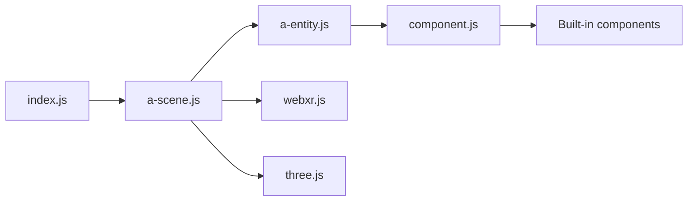

# aframevr/aframe

> Framework web déclaratif en HTML pour scènes 3D, VR et AR, au-dessus de three.js.

## Le problème
Construire une expérience WebXR demande beaucoup de code WebGL et de gestion de casques.

## Ce que ça fait vraiment
Des balises (`a-scene`, `a-box`, `a-sphere`…) déclarent la scène ; une architecture entité-composant rend les objets via three.js, avec géométries, matériaux, lumières, animations, modèles, rayons et contrôleurs intégrés. Fonctionne aussi sans casque (desktop, mobile). Inspecteur visuel intégré, composants communautaires (particules, physique, océan).

## Comment c'est branché


## Essayer
```bash
npm install --save aframe
git clone https://github.com/aframevr/aframe.git
cd aframe && npm install
npm start
```

## Coût et pièges
Gratuit. Tester en VR exige HTTPS avec un certificat auto-signé (`npm run start:https`). 338 issues ouvertes.

## Ce que ce n'est pas
Pas un moteur de jeu complet ; la physique ou le multi-utilisateur passent par des composants tiers.

## Alternatives
Aucune alternative nommée dans le README (three.js est la base).

## Pour toi
Utile pour visualisations 3D immersives de données ; hors cœur de métier data/MLOps.

