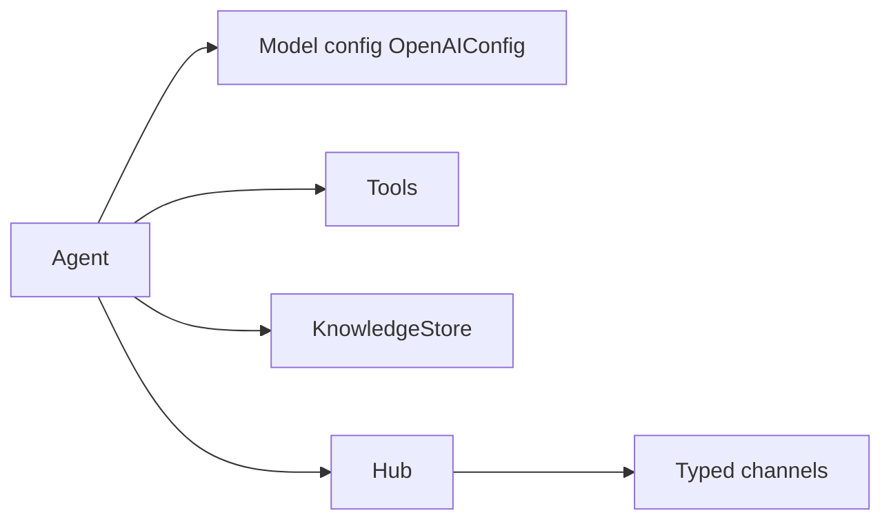

# ag2ai/ag2

> Framework Python d'agents IA, réécrit en v1.0 autour d'un réseau d'agents, pour développeurs d'applications agentiques.

## Le problème
Construire des agents qui appellent des outils, demandent l'avis d'un humain et coopèrent, sans réécrire la boucle d'orchestration.

## Ce que ça fait vraiment
`Agent` asynchrone avec outils `@tool`, retour humain via `context.input`, mémoire (`knowledge=`) et compaction de l'historique. Plusieurs agents collaborent via un `Hub` et des canaux typés (`conversation`, `consulting`, `discussion`, `workflow`). L'ancien framework (`autogen`) est déplacé dans `ag2-classic`.

## Comment c'est branché
Le diagramme fourni décrit l'ancienne base `autogen/`, en décalage avec le README v1.0 : schéma tiré du README.


## Essayer
```bash
pip install ag2[openai]
export OPENAI_API_KEY="<your-api-key>"
```

## Coût et pièges
Clé du fournisseur à ta charge. Rupture : `pip install ag2` n'est pas une mise à jour compatible de l'ancien AG2 ; les projets existants doivent fixer `ag2-classic`.

## Ce que ce n'est pas
Pas un simple renommage : `import autogen`, `ConversableAgent` et `GroupChat` ont quitté ce dépôt. Le diagramme d'architecture fourni décrit l'ancien code.

## Alternatives
- ag2-classic : pour garder le code AutoGen existant.

## Pour toi
À surveiller : intéressant pour tester la v1.0, mais la rupture avec la version classique et le diagramme périmé appellent de la prudence.
