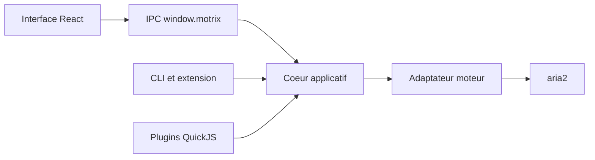

# agalwood/Motrix

> Gestionnaire de téléchargements HTTP, FTP, BitTorrent et magnet pour poste de travail ou serveur sans écran.

## Le problème
Regrouper téléchargements directs et torrents dans une interface unique, pilotable par navigateur, ligne de commande et serveur.

## Ce que ça fait vraiment
Motrix « Turbo » (v2, actuellement en bêta) est réécrit en Electron, React et TypeScript, avec moteur aria2 embarqué, sessions SQLite, protocole MDXP (JSON-RPC 2.0), client `@motrix/cli`, extension de navigateur et plugins dans un bac à sable QuickJS. Un serveur sans écran tourne sous Node.js ou Docker avec interface web. L'analyse d'architecture parle de Vue (v1) : le README de la v2 fait foi.

## Comment c'est branché


## Essayer
```bash
npm install -g @motrix/cli
motrix add https://example.com/file.iso --save-dir ~/Downloads
motrix list
```

## Coût et pièges
Gratuit. Bêta : le README demande de sauvegarder ses données et signale que la migration depuis la v1 n'est pas validée. Binaires Windows non signés (avertissement SmartScreen). Licence non identifiée par GitHub.

## Ce que ce n'est pas
Ce n'est pas une version stable, et il ne fait pas de résolution de téléchargement de sites sans plugin.

## Alternatives
Aucune alternative nommée dans le README.

## Pour toi
Ignorer : gestionnaire de téléchargements généraliste en bêta, sans apport particulier pour tes travaux de données ou d'IA.

