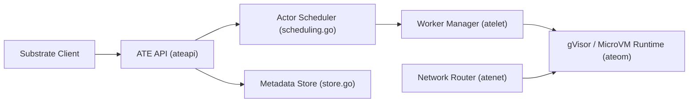

# agent-substrate/substrate

> Runtime Kubernetes qui multiplexe de nombreux agents avec état sur peu de workers, pour opérateurs d'infrastructure d'agents.

## Le problème
Un agent reste inactif la plupart du temps mais occupe un pod entier ; à grande échelle, la densité et le temps de reprise deviennent le goulot.

## Ce que ça fait vraiment
Associe des « actors » à un plus petit ensemble de « workers » (pods), suspend et reprend leur état par snapshots, route le trafic entrant. Supporte gVisor et microVM. Le README annonce reprise sous 500 ms et densité ×10 : ce sont des chiffres de l'auteur, non vérifiés ici. Le projet dit lui-même être en développement précoce, API instables.

## Comment c'est branché


## Essayer
```bash
hack/create-kind-cluster.sh
hack/install-ate-kind.sh --deploy-ate-system
hack/install-ate-kind.sh --deploy-demo-counter
go install ./cmd/kubectl-ate
kubectl ate create actor my-counter-1 -a ate-demo-counter --template counter
kubectl port-forward -n ate-system svc/atenet-router 8000:80
curl -X POST -H "ate-target-actor: ate-demo-counter/my-counter-1" -i http://localhost:8000/
```

## Coût et pièges
Demande Go, kubectl, Docker, un cluster (kind en local, GKE sinon avec ressources GCP facturées) et PostgreSQL. Les nœuds ajoutés plus tard exigent un label de version.

## Ce que ce n'est pas
Pas un SDK pour construire des agents. Pas prêt pour la production selon le README. Ce n'est pas un produit Google officiellement supporté.

## Alternatives
Aucune alternative nommée dans le README ; kagent est cité comme consommateur, pas comme concurrent.

## Pour toi
À surveiller : pertinent si tu opères des agents à grande échelle sur Kubernetes, mais trop jeune et instable pour être adopté maintenant.

