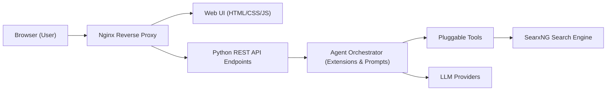

# agent0ai/agent-zero

> Framework d'agent en conteneur Docker avec bureau Linux, navigateur annotable et coédition de documents.

## Le problème
Les agents en chat ne peuvent ni utiliser de logiciels graphiques ni travailler sur de vrais fichiers de façon visible et réversible.

## Ce que ça fait vraiment
Donne à l'agent un bureau XFCE dans le conteneur, visible dans l'interface, avec LibreOffice et d'autres logiciels.
Navigateur intégré avec mode Annotate : cliquer un élément pour le modifier, l'inspecter ou le réimplémenter.
Projets isolés (fichiers, mémoire, secrets), sous-agents, plugins, skills, MCP, A2A ; snapshots « Time Travel » de l'espace de travail.
Le connecteur A0 CLI relie l'instance à ta machine hôte.

## Comment c'est branché


## Essayer
```bash
docker run -p 80:80 -v a0_usr:/a0/usr agent0ai/agent-zero
curl -fsSL https://bash.agent-zero.ai | bash
curl -LsSf https://cli.agent-zero.ai/install.sh | sh
```

## Coût et pièges
Fournisseur LLM à configurer (ou plan Codex via OAuth). Les installations se font par `curl | bash`, à relire avant exécution.

## Ce que ce n'est pas
Pas sans risque : le README recommande de ne pas monter ton home et de restreindre l'accès hôte. Time Travel ne remplace ni Git ni des sauvegardes. Licence non identifiée par GitHub.

## Alternatives
Aucune alternative nommée dans le README.

## Pour toi
À surveiller : l'isolation Docker et l'accès hôte contrôlé en font un bac à sable d'agent plus sûr que d'autres, mais la licence reste à vérifier.
