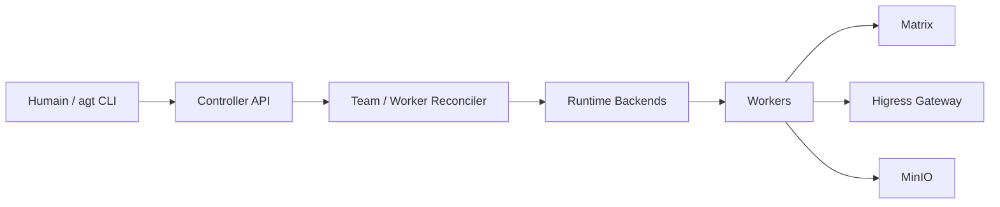

# agentscope-ai/AgentTeams

> Plateforme Manager-Workers qui fait collaborer plusieurs agents dans des salons Matrix visibles et pilotables par des humains.

## Le problème
Faire travailler plusieurs agents en équipe sans qu'ils détiennent chacun les vraies clés d'API, et sans boîte noire entre eux.

## Ce que ça fait vraiment
Un contrôleur Kubernetes réconcilie des ressources Manager, Team, Worker et Human. Chaque agent (OpenClaw, QwenPaw, Hermes, DeepSeek Harness expérimental) tourne dans son conteneur. Ils échangent dans des salons Matrix (Tuwunel + Element Web), partagent des fichiers via MinIO, et passent par la passerelle Higress qui garde les vrais identifiants : les Workers n'ont qu'un jeton consommateur.

## Comment c'est branché


## Essayer
```bash
bash <(curl -sSL https://raw.githubusercontent.com/agentscope-ai/AgentTeams/main/install/agentteams-install.sh)
```
Puis ouvrir http://127.0.0.1:18088 (Element Web). Alternative Kubernetes : `helm install agentteams higress.io/agentteams -n agentteams-system --create-namespace ...` avec `credentials.llmApiKey`.

## Coût et pièges
Clé d'API LLM à ta charge ; minimum 2 CPU et 4 Go de RAM, 4 cœurs et 8 Go pour plusieurs Workers. Images pointées par défaut sur un registre chinois. L'installeur passe par `curl | bash`.

## Ce que ce n'est pas
Pas un runtime d'agent : il orchestre des conteneurs d'agents existants. Le Manager n'est compatible qu'avec OpenClaw ou QwenPaw ; DeepSeek Harness est expérimental. Environ 250 issues ouvertes.

## Alternatives
- OpenClaw natif : un seul processus, plus simple mais chaque agent détient ses clés.

## Pour toi
À surveiller : l'idée de jetons consommateur derrière une passerelle est utile pour un MLOps qui déploie des agents en équipe, mais la pile (Matrix, Higress, MinIO, K8s) est lourde pour un simple test.
