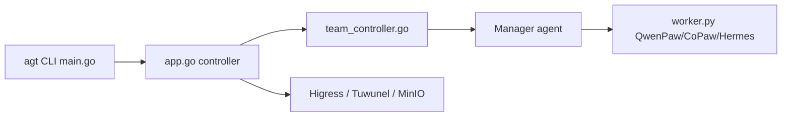

# agentscope-ai/HiClaw

> Runtime multi-agents Manager–Workers où humains et agents collaborent dans des salons Matrix visibles.

## Le problème
Faire coopérer plusieurs agents sans perdre la visibilité humaine, ni laisser chaque agent détenir de vraies clés d'API.

## Ce que ça fait vraiment
Un Manager crée et pilote des Workers (OpenClaw, QwenPaw, Hermes, DeepSeek Harness expérimental) dans des salons Matrix (Tuwunel + Element Web). Une passerelle Higress garde les vrais identifiants : les Workers n'ont que des jetons consommateur. MinIO sert de stockage partagé. Un installeur Docker, ou un chart Helm pour Kubernetes (contrôleur, CRD Worker/Team/Human). Le README se présente sous le nom « AgentTeams ».

## Comment c'est branché


## Essayer
```bash
bash <(curl -sSL https://raw.githubusercontent.com/agentscope-ai/AgentTeams/main/install/agentteams-install.sh)
```
Puis ouvrir http://127.0.0.1:18088.

## Coût et pièges
Clé d'API LLM à ta charge ; 2 CPU et 4 Go de RAM au minimum. Le README installe via `curl | bash`. Les images pointent par défaut vers un registre chinois.

## Ce que ce n'est pas
Pas un framework d'agents : il orchestre des conteneurs d'agents existants. Le runtime DeepSeek Harness est expérimental.

## Alternatives
- OpenClaw natif : comparé dans le tableau du README (un seul processus, clés détenues par chaque agent).

## Pour toi
À surveiller : l'idée de clés isolées derrière une passerelle est intéressante pour des agents en production, mais le projet est jeune et très lié à l'écosystème agentscope.

