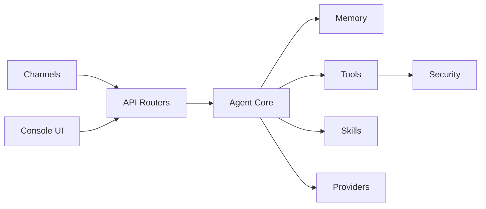

# agentscope-ai/QwenPaw

> Assistant IA personnel auto-hébergé, multi-canaux et extensible par skills, pour usage individuel.

## Le problème
Les assistants IA grand public gardent vos données chez eux et ne se branchent pas sur vos messageries ni vos tâches planifiées.

## Ce que ça fait vraiment
Backend Python (`qwenpaw app`) + console React sur le port 8088, TUI et appli de bureau Tauri (bêta).
Boucle d'agent ReAct, mémoire à trois niveaux (ReMe), multi-agents, cron, MCP, skills et plugins.
Adaptateurs DingTalk, Lark, WeChat, Discord, Telegram, iMessage, QQ ; fournisseurs cloud ou locaux (llama.cpp, Ollama, LM Studio), modèles QwenPaw-Flash 2B/4B/9B.
Sandbox noyau, Tool Guard, File Guard, scanner de skills, politique d'accès.

## Comment c'est branché


## Essayer
```bash
pip install qwenpaw
qwenpaw init --defaults
qwenpaw app
docker pull agentscope/qwenpaw:latest
```

## Coût et pièges
Clé d'API nécessaire pour un LLM cloud (facture à ta charge) ; gratuit en local. Télémétrie anonyme acceptée d'office avec `--defaults`. Python 3.11 à 3.13.

## Ce que ce n'est pas
Pas un framework d'agents à embarquer dans ton code (c'est une appli). Canaux surtout orientés écosystème chinois ; appli bureau encore en bêta et non notarisée sur macOS.

## Alternatives
Aucune alternative nommée dans le README.

## Pour toi
À tester si tu veux un agent perso local avec cron et MCP ; désactive la télémétrie à l'init.
