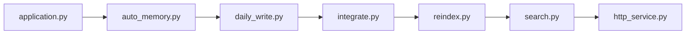

# agentscope-ai/ReMe

> Base de connaissances locale en Markdown qui donne une mémoire durable et partagée à des agents IA.

## Le problème
Les agents oublient d'une session à l'autre, et leur mémoire reste opaque et non modifiable par l'utilisateur.

## Ce que ça fait vraiment
Stocke la mémoire en fichiers Markdown avec frontmatter et liens wiki dans un espace de travail (`session/`, `resource/`, `daily/`, `digest/`). Des tâches capturent les conversations (`auto_memory`), importent des ressources, indexent et consolident en connaissances durables (`auto_dream`). La recherche combine BM25, vecteurs optionnels et expansion par liens. Accessible par CLI, HTTP, MCP et API Python, avec intégrations pour Claude Code, OpenClaw, QwenPaw, Hermes et DeepSeek Harness, plus une interface Studio.

## Comment c'est branché


## Essayer
```bash
pip install "reme-ai[core]"
reme start
reme write path=digest/wiki/quick-start-demo name="Quick Start Demo" description="A first ReMe memory node" content="# Quick Start Demo"
reme search query="agent memory markdown" limit=5
reme health_check
```

## Coût et pièges
Les fonctions d'évolution automatique exigent `LLM_API_KEY` ; les embeddings sont désactivés par défaut. Service local sur `127.0.0.1:2333`. Node.js 22.13+ seulement pour un build depuis les sources.

## Ce que ce n'est pas
Pas une base vectorielle : la source de vérité est l'ensemble des fichiers. Les scores de benchmark (LongMemEval 89,4 %) sont ceux du dépôt.

## Alternatives
Aucune alternative citée dans le README.

## Pour toi
À surveiller : approche lisible et versionnable de la mémoire d'agents, à essayer si tu multiplies les agents ; la dépendance à l'écosystème agentscope reste marquée.

