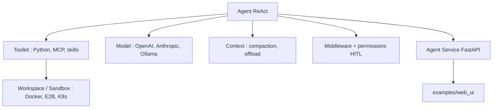

# agentscope-ai/agentscope

> Framework d'agents Python avec SDK, service multi-tenant, Web UI et sandboxes d'exécution.

## Le problème
Passer d'un agent de démonstration à une application multi-utilisateur demande sessions, persistance, permissions, UI et canaux de messagerie.
Les frameworks qui contraignent le modèle par des prompts rigides vieillissent mal à mesure que les modèles progressent.

## Ce que ça fait vraiment
Couche SDK : boucle ReAct avec sortie structurée, interruption et reprise en temps réel, acting par lots ; Toolkit gérant outils Python, serveurs MCP et skills, avec outils de codage intégrés (shell, édition de fichiers, recherche).
Modèles LLM, embedding et TTS chez OpenAI, Anthropic, Gemini, DashScope, DeepSeek, Moonshot, Volcengine, xAI, Ollama ; contexte avec compaction automatique, déport des résultats d'outils et injection via middleware.
Permissions et HITL à granularité fine, bus d'événements unifié (raisonnement, appels d'outils, texte/image/audio), mémoire à backends interchangeables (ReMe, Mem0).
Couche service : backend FastAPI et Web UI préconstruite, multi-tenant et multi-session, équipes leader/workers, canaux Feishu et Discord, service RAG, hub MCP et skills, planification de tâches et réveil d'agent.

## Comment c'est branché


## Essayer
```bash
uv pip install agentscope
```

```bash
git clone -b main https://github.com/agentscope-ai/agentscope.git
cd agentscope/examples/agent_service
python main.py
```

## Coût et pièges
Apache-2.0, gratuit ; les appels aux modèles restent à votre charge (l'exemple utilise `DASHSCOPE_API_KEY`).
Python 3.11 minimum ; la Web UI demande pnpm en plus. Les sandboxes (Docker, E2B, Daytona, K8s) sont autant de dépendances à provisionner.

## Ce que ce n'est pas
Ce n'est pas un framework à orchestration imposée : le parti pris annoncé est de s'appuyer sur le raisonnement du modèle plutôt que de le contraindre.
Ce n'est pas un produit fini : c'est un ensemble de briques composables, avec de la colle à écrire.
Ce n'est pas indépendant d'Alibaba : DashScope est le fournisseur des exemples.

## Alternatives
Aucun framework concurrent n'est nommé ; ReMe et Mem0 sont cités comme backends de mémoire.

## Pour toi
Le framework le plus complet du bloc côté service : à considérer si tu dois livrer une appli d'agents, pas un script.
