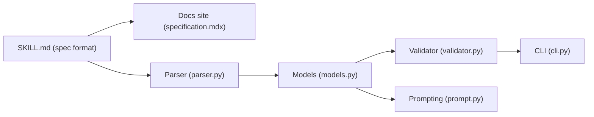

# agentskills/agentskills

> Spécification ouverte des Agent Skills : dossiers de savoir-faire chargés à la demande par les agents IA.

## Le problème
Les agents manquent de contexte spécifique pour des tâches fiables, et chaque produit invente son propre format de consignes réutilisables.

## Ce que ça fait vraiment
Définit un format portable : un dossier avec un `SKILL.md` (nom, description, instructions) et éventuellement scripts, références et ressources. Les agents suivent une divulgation progressive : découverte (nom et description seuls), activation (lecture du SKILL.md complet), exécution. Le dépôt contient le site de documentation (spécification, guides de création, guide d'implémentation client, vitrine des clients) et un paquet Python de référence `skills-ref` (parseur, modèles, validateur, génération de prompt, CLI).

## Comment c'est branché

## Essayer
Le README ne fournit pas de commande ; il renvoie à la documentation, à la spécification et aux exemples de skills.

## Coût et pièges
Gratuit. Le format vient d'Anthropic, publié comme standard ouvert selon le README. Le paquet Python est une implémentation de référence, pas un runtime d'agent.

## Ce que ce n'est pas
Ce n'est pas un agent ni une bibliothèque d'exécution : le dépôt normalise les entrées que les clients chargent. Le répertoire `.claude/` du dépôt relève de l'outillage de maintenance.

## Alternatives
- Aucune alternative nommée dans le README.

## Pour toi
Adopter : c'est le format à connaître pour packager ton savoir-faire data/MLOps en skills réutilisables entre agents, avec un validateur de référence.

