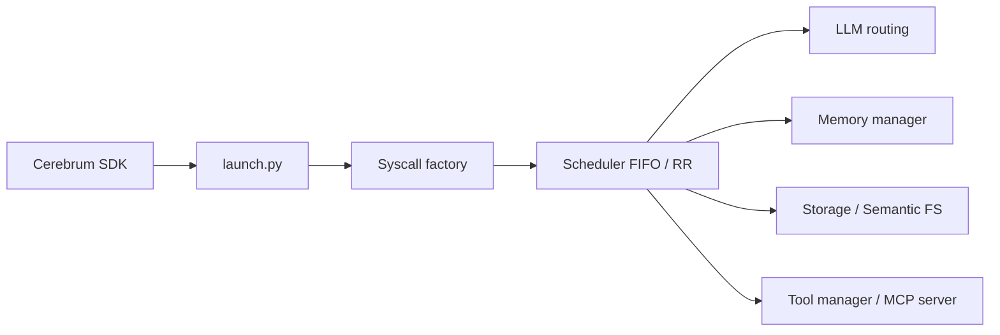

# agiresearch/AIOS

> Noyau de recherche « système d'exploitation pour agents LLM » : ordonnancement, mémoire, stockage, outils.

## Le problème
Plusieurs agents qui partagent LLM, mémoire et outils se marchent dessus sans ordonnancement ni gestion des ressources.

## Ce que ça fait vraiment
Serveur (Uvicorn) recevant des « syscalls » d'agents via le SDK Cerebrum, ordonnancés en FIFO ou round-robin.
Sous-systèmes : routage LLM (OpenAI, Anthropic, Ollama, vLLM, HuggingFace…), mémoire (maison, Mem0, Zep), stockage et système de fichiers sémantique.
Gestionnaire d'outils avec serveur MCP et machines virtuelles pour agents de computer-use.
Terminal en langage naturel ; portage Rust expérimental.

## Comment c'est branché


## Essayer
```bash
git clone https://github.com/agiresearch/AIOS.git
pip install -r requirements.txt
git clone https://github.com/agiresearch/Cerebrum.git
cd Cerebrum && pip install -e .
bash runtime/launch_kernel.sh
python scripts/run_terminal.py
```

## Coût et pièges
Clés API ou GPU local (vLLM Linux GPU) ; Python 3.10–3.11 uniquement ; Redis pour le rollback du terminal.
Modes de déploiement 3 et 4 encore non disponibles.

## Ce que ce n'est pas
Pas un vrai système d'exploitation : une couche Python au-dessus de l'OS.
Pas un framework d'agents mature pour la production.

## Alternatives
Aucune alternative nommée dans le README.

## Pour toi
À ignorer en pratique : projet de recherche académique à suivre via ses papiers, pas une brique à intégrer ; licence à vérifier.
