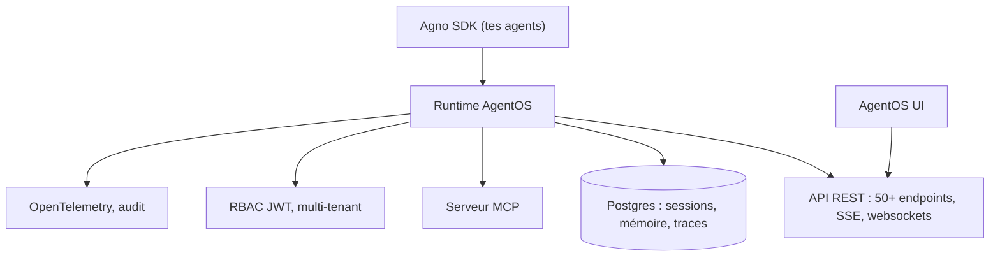

# agno-agi/agno

> Framework et runtime pour héberger sa propre plateforme d'agents, API et console comprises.

## Le problème
Passer d'un agent qui tourne dans un notebook à un service multi-utilisateurs demande API,
stockage, authentification, traces et supervision — tout ce qu'on écrit à la main sinon.

## Ce que ça fait vraiment
Trois briques : le SDK Agno pour construire, le runtime AgentOS pour servir, l'interface AgentOS
pour administrer. Expose plus de 50 endpoints avec SSE et websockets.
Stocke sessions, mémoire, connaissances et traces dans ta propre base. Fournit RBAC par JWT et
isolation multi-utilisateurs/multi-tenants, approbation humaine avec mise en pause d'une exécution,
et blocage des outils qui exigent un accord d'administrateur.
Apporte plus de 100 intégrations (GitHub, Slack, Postgres), des Context Providers vers des données
vivantes, du traçage OpenTelemetry, l'exposition via Slack, Telegram, WhatsApp, Discord, A2A,
et une planification cron sans infrastructure externe.

## Comment c'est branché


## Essayer
```text
Help me set up my agent platform.

Clone https://github.com/agno-agi/agentos-railway into a folder called
agent-platform, cd in, read the README, and follow the get started guide.
```

## Coût et pièges
Le framework est gratuit ; l'infrastructure (conteneurs, Postgres) et les modèles sont à ta charge.
Le démarrage recommandé passe par un agent de code qui clone un dépôt gabarit — il existe un
gabarit par cible de déploiement. Télémétrie activée par défaut : un événement par exécution
d'agent, à couper avec `AGNO_TELEMETRY=false` ; le README affirme que prompts et sorties
ne sont pas transmis.

## Ce que ce n'est pas
Ce n'est pas un agent prêt à l'emploi : c'est l'échafaudage autour des tiens. Ce n'est pas
un service géré, tout tourne chez toi. Le README ne donne aucun exemple de code direct,
il renvoie à des gabarits.

## Alternatives
Aucune alternative nommée dans le README.

## Pour toi
À regarder le jour où un agent doit sortir du notebook avec authentification et traces.
