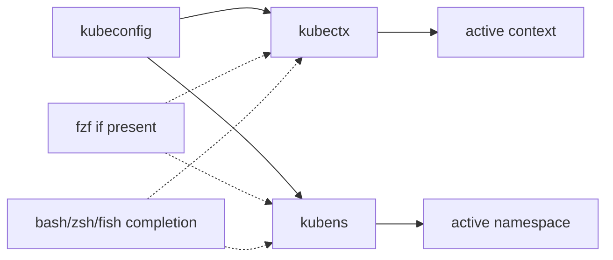

# ahmetb/kubectx

> **Two small commands to switch kubectl clusters and namespaces without editing kubeconfig by hand.**

## The problem

Without them, switching cluster or namespace means going through `kubectl config` and typing
long context names such as `gke_ahmetb_europe-west1-b_dublin` every time. The README states no
problem beyond this daily friction.

## What it actually does

`kubectx` switches between contexts declared in kubeconfig, returns to the previous one with
`-`, and renames a context (`kubectx dublin=gke_...`). It can also start a shell isolated to a
single context (`-s`) and a read-only shell where write operations are blocked (`-r`).
`kubens` does the same for the active namespace, with `-` for the previous namespace and `-f`
to switch to a namespace that does not exist. Both ship Tab completion for bash, zsh and fish.
If `fzf` is in `$PATH`, both commands show an interactive fuzzy-search menu;
`KUBECTX_IGNORE_FZF=1` opts out of it.

## How it is wired



No code-derived diagram exists for this repository; the graph above is rebuilt from the
README. The repository holds a `completion/` directory (`_kubectx.zsh`, `_kubens.zsh`,
`kubectx.bash`, `kubens.bash`, `kubectx.fish`, `kubens.fish`) that manual installs symlink
into the shell's `$fpath` or completion directory.

## Trying it

```sh
brew install kubectx
```

```sh
$ kubectx minikube
Switched to context "minikube".
$ kubectx -
$ kubens kube-system
$ kubens -
```

Other documented channels: `sudo apt install kubectx`, `sudo pacman -S kubectx`,
`choco install kubens kubectx`, `winget install --id ahmetb.kubectx`, or
`kubectl krew install ctx && kubectl krew install ns`. Binaries are also published on the
Releases page and can be dropped anywhere in `PATH`.

## Cost and gotchas

Free, no account, no API key, no third-party service. Interactive mode assumes `fzf` is
installed separately; if it is present and unwanted, you need `KUBECTX_IGNORE_FZF=1`, or pipe
the output (`kubectx | cat`) to get the default behaviour back. Colors are set through
`KUBECTX_CURRENT_FGCOLOR` / `KUBECTX_CURRENT_BGCOLOR` and disabled with `NO_COLOR`. Installing
zsh completion requires editing `$fpath` and sometimes calling `compinit` — most of the README
install section is spent on those cases. The repository is carried by a personal account.

## What it is not

It is not a cluster manager or a deployment tool: it creates and provisions nothing, it only
acts on the local kubeconfig. It is not a permanent context indicator in your prompt either —
the README points to `kube-ps1` or `oh-my-posh` for that. The read-only shell (`-r`) blocks
write operations in the shell it starts; it is not a cluster-side permission model.

## Alternatives

Named in the README: `kube-ps1` (jonmosco) to show context and namespace in the prompt,
complementary rather than competing; `kubectl-aliases` (same author) to shorten kubectl
commands themselves; `krew` (kubernetes-sigs), used here as a kubectl-plugin install channel.
Among the supplied neighbours (argo-cd, argo-workflows, keda, checkov) none is comparable:
they are deployment, autoscaling or static-analysis platforms, not context-switching
utilities.

## Why it matters to you

If you touch Kubernetes from a workstation — cluster training jobs, MLOps pipelines, several
environments — this is a two-minute install that removes a daily friction. If all your
Kubernetes work goes through CI or a portal, it brings you nothing.
