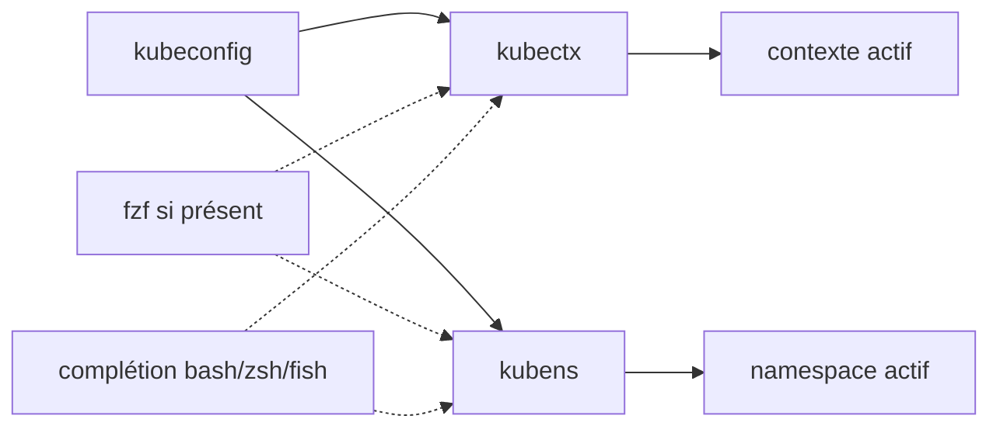

# ahmetb/kubectx

> **Deux petites commandes pour changer de cluster et de namespace kubectl sans éditer le kubeconfig.**

## Le problème

Sans elles, changer de cluster ou de namespace passe par `kubectl config` et des noms de
contextes interminables du genre `gke_ahmetb_europe-west1-b_dublin`, tapés à la main à chaque
fois. Le README ne décrit pas d'autre problème que cette friction quotidienne.

## Ce que ça fait vraiment

`kubectx` bascule d'un contexte kubeconfig à un autre, revient au précédent avec `-`, et
renomme un contexte (`kubectx dublin=gke_...`). Il sait aussi ouvrir un shell isolé sur un
seul contexte (`-s`) et un shell en lecture seule où les écritures sont bloquées (`-r`).
`kubens` fait la même chose pour le namespace actif, avec retour au précédent par `-` et
forçage sur un namespace inexistant par `-f`. Les deux fournissent la complétion <kbd>Tab</kbd>
pour bash, zsh et fish. Si `fzf` est présent dans le `$PATH`, les deux commandes affichent un
menu interactif avec recherche floue ; `KUBECTX_IGNORE_FZF=1` désactive ce comportement.

## Comment c'est branché



Aucun diagramme tiré du code n'existe pour ce dépôt : ce schéma est reconstruit depuis le
README. Le dépôt contient un répertoire `completion/` (`_kubectx.zsh`, `_kubens.zsh`,
`kubectx.bash`, `kubens.bash`, `kubectx.fish`, `kubens.fish`) que l'installation manuelle
lie dans le `$fpath` ou le dossier de complétion du shell.

## Essayer

```sh
brew install kubectx
```

```sh
$ kubectx minikube
Switched to context "minikube".
$ kubectx -
$ kubens kube-system
$ kubens -
```

Autres canaux documentés : `sudo apt install kubectx`, `sudo pacman -S kubectx`,
`choco install kubens kubectx`, `winget install --id ahmetb.kubectx`, ou
`kubectl krew install ctx && kubectl krew install ns`. Des binaires sont aussi publiés sur la
page Releases, à déposer dans le `PATH`.

## Coût et pièges

Gratuit, aucun compte, aucune clé d'API, aucun service tiers. Le mode interactif suppose
`fzf` installé séparément ; s'il est là et qu'on n'en veut pas, il faut penser à
`KUBECTX_IGNORE_FZF=1`, ou piper la sortie (`kubectx | cat`) pour retrouver le comportement
par défaut. Les couleurs se règlent par `KUBECTX_CURRENT_FGCOLOR` / `KUBECTX_CURRENT_BGCOLOR`
et se coupent avec `NO_COLOR`. L'installation de la complétion zsh demande de bricoler le
`$fpath` et parfois `compinit` — le README consacre l'essentiel de sa section installation à
ces cas. Le dépôt est porté par un compte personnel.

## Ce que ce n'est pas

Ce n'est pas un gestionnaire de clusters ni un outil de déploiement : il ne crée rien, ne
provisionne rien, il n'agit que sur le kubeconfig local. Ce n'est pas non plus un affichage
permanent du contexte dans le prompt — le README renvoie pour cela à `kube-ps1` ou
`oh-my-posh`. Le shell en lecture seule (`-r`) bloque les opérations d'écriture au niveau du
contexte lancé, ce n'est pas un modèle de permissions côté cluster.

## Alternatives

Nommés dans le README : `kube-ps1` (jonmosco) pour afficher contexte et namespace dans le
prompt, complémentaire plutôt que concurrent ; `kubectl-aliases` (même auteur) pour raccourcir
les commandes kubectl elles-mêmes ; `krew` (kubernetes-sigs) qui sert ici de canal
d'installation en plugins kubectl. Parmi les voisins fournis (argo-cd, argo-workflows, keda,
checkov), aucun n'est comparable : ce sont des plateformes de déploiement, d'autoscaling ou
d'analyse statique, pas des utilitaires de bascule de contexte.

## Pour toi

Si tu touches à Kubernetes depuis un poste de travail — entraînements sur cluster, pipelines
MLOps, plusieurs environnements — c'est deux minutes d'installation pour une friction
supprimée tous les jours. Si tout ton Kubernetes passe par une CI ou un portail, ça ne
t'apporte rien.
