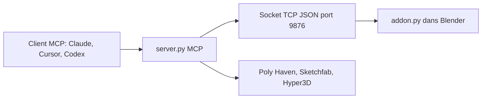

# ahujasid/blender-mcp

> Connecte Blender à un LLM par MCP pour modéliser et composer des scènes 3D par prompt.

## Le problème
Piloter Blender à la main est long ; un LLM ne voit pas la scène et ne peut pas la modifier.

## Ce que ça fait vraiment
Un addon Blender ouvre un serveur socket, et un serveur MCP Python lui envoie des commandes JSON : inspection de scène, création et modification d'objets, matériaux, exécution de code Python dans Blender, export GLB/FBX. Récupération d'assets Poly Haven, Sketchfab, Poly Pizza, et génération 3D via Hyper3D Rodin ou Hunyuan3D. Un mode sûr filtre les scripts.

## Comment c'est branché


## Essayer
```bash
claude mcp add blender uvx mcp-for-blender
uvx mcp-for-blender install-addon
DISABLE_TELEMETRY=true uvx mcp-for-blender
```

## Coût et pièges
Gratuit ; certaines sources demandent une clé (Sketchfab, Poly Pizza, Hyper3D, Hunyuan3D). Blender 3.0+, Python 3.10+, uv. Le socket n'a ni authentification ni chiffrement.

## Ce que ce n'est pas
Pas sûr par défaut : l'IA peut exécuter n'importe quel code Python, à activer en mode sûr. Une télémétrie anonyme minimale est active sans consentement ; le contenu n'est collecté qu'avec opt-in.

## Alternatives
Aucune alternative nommée dans le README.

## Pour toi
À ignorer : hors du champ data/IA, avec exécution de code non authentifiée et télémétrie active par défaut.
