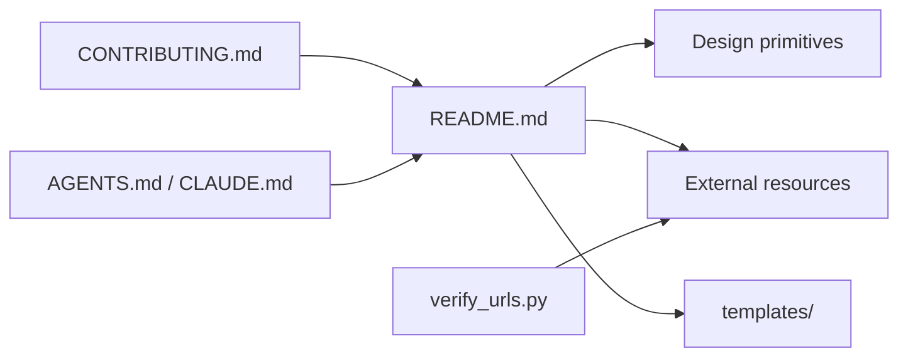

# ai-boost/awesome-harness-engineering

> Liste annotée d'articles, papiers et dépôts sur le harnais qui entoure un agent IA, pour ingénieurs agents.

## Le problème
Les bonnes pratiques pour cadrer un agent (contexte, outils, mémoire, permissions, vérification) sont éparpillées entre blogs d'éditeurs, papiers et dépôts. Sans carte, on redécouvre les mêmes pièges.

## Ce que ça fait vraiment
Le README est un index commenté : chaque entrée dit pourquoi elle mérite d'être lue. Il classe les ressources par primitive de harnais : boucle d'agent, planification, contexte et compaction, outils, skills et MCP, permissions, mémoire, orchestration, vérification, observabilité, débogage, humain dans la boucle. S'y ajoutent des sections d'implémentations de référence, de sandbox, d'évals et d'infrastructure. Le dossier `templates/` fournit quatre modèles Markdown (AGENTS, PLAN, IMPLEMENT, checklist), et `verify_urls.py` contrôle les liens.

## Comment c'est branché

## Essayer
Aucune commande documentée dans le README : la liste se lit directement sur GitHub.

## Coût et pièges
Gratuit, rien à installer. Le seul outil exécutable est `verify_urls.py`, qui demande un environnement Python. La licence est présente mais GitHub ne l'identifie pas : à lire avant toute réutilisation des templates.

## Ce que ce n'est pas
Ce n'est ni un framework ni un harnais exécutable : c'est de la documentation. Les commentaires sont ceux du mainteneur et reprennent souvent le ton des sources (« la meilleure », « la plus complète ») : vérifier chaque ressource. Le volume, plusieurs centaines d'entrées, en fait une bibliothèque à fouiller, pas une sélection resserrée.

## Alternatives
- AutoJunjie/awesome-agent-harness : liste plus courte, organisée en plateformes, runners, runtimes et agents de code.
- Picrew/awesome-agent-harness : centrée sur les dépôts GitHub, avec 150 entrées en neuf catégories.
- RyanAlberts/best-of-Agent-Harnesses : classement de 124 harnais, republié chaque semaine en données lisibles par machine.

## Pour toi
À adopter comme marque-page de référence : si tu construis ou évalues des agents, c'est le moyen le plus rapide de situer un outil dans le paysage, sans rien installer.
