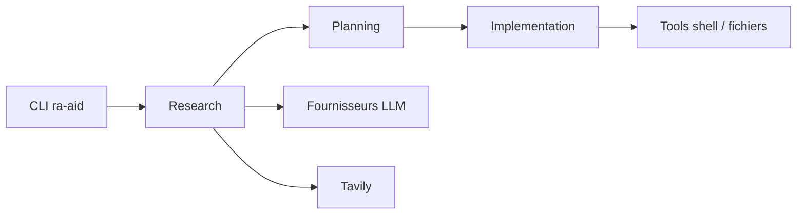

# ai-christianson/RA.Aid

> Agent de code autonome en ligne de commande, bâti sur LangGraph : recherche, planification, implémentation.

## Le problème
Les tâches de développement multi-étapes dépassent l'édition de code en un coup : il faut explorer, planifier puis exécuter.

## Ce que ça fait vraiment
Agent en trois étapes (recherche, planification, implémentation) sur LangGraph, avec exécution de commandes shell, opérations sur fichiers, mémoire, Git et recherche web via Tavily. Il peut déléguer l'édition à aider (`--use-aider`), interroger un modèle « expert » distinct, et offre un mode humain dans la boucle, un chat et un serveur web alpha. Fournisseurs : Anthropic (défaut), OpenAI, OpenRouter, Gemini, DeepSeek, Makehub.

## Comment c'est branché


## Essayer
```bash
pip install ra-aid
ra-aid -m "Your task or query here"
ra-aid -m "Explain the authentication flow" --research-only
```

## Coût et pièges
Clés d'API à ta charge (`--max-cost`, `--show-cost` disponibles). Le mode `--cowboy-mode` exécute les commandes shell sans confirmation : dépôt propre et versionné recommandé.

## Ce que ce n'est pas
Pas « pleinement autonome » sans surveillance : le README lui-même demande de relire ses actions. Dernier push 2026-01-30 ; le modèle par défaut cité est ancien.

## Alternatives
- aider : peut être intégré via `--use-aider`.

## Pour toi
Surveiller : un agent de code de plus, moins suivi que les principaux ; utile pour voir le schéma recherche-plan-exécution.
