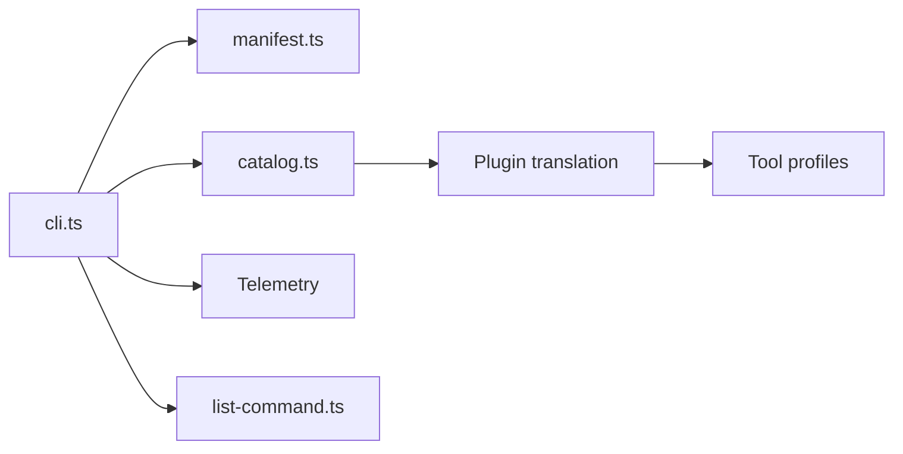

# ai-driven-dev/framework

> Plugins de skills, agents et commandes qui installent un cycle de développement complet dans votre outil de codage IA.

## Le problème
Chaque équipe réécrit ses propres commandes et règles pour cadrer, planifier, valider et relire le travail d'un agent de code.

## Ce que ça fait vraiment
Huit plugins (environ 50 skills, 2 agents) couvrent contexte projet, développement, VCS, gestion de produit, revue critique et orchestration. La commande `/aidd-orchestrator:01-sdlc` enchaîne cadrage, plan, implémentation, validation, revue et PR. Fonctionne nativement avec Claude Code, et avec Cursor, Copilot, Codex et OpenCode. Node 22 sert aux hooks.

## Comment c'est branché


## Essayer
```bash
claude plugin marketplace add ai-driven-dev/framework
claude plugin install aidd-context@aidd-framework
claude plugin install aidd-orchestrator@aidd-framework
```
Puis, dans la session : `/aidd-context:00-onboard`.

## Coût et pièges
Gratuit, mais les plugins agissent avec tes permissions et certains lancent des hooks Node : lire `hooks/` avant d'installer. La télémétrie (bêta) est locale d'après le README, désactivable avec `AIDD_TELEMETRY=0`. 71 issues ouvertes.

## Ce que ce n'est pas
Pas un agent en soi, ni un garde-fou : les workflows sont des fichiers markdown. Le qualificatif « enterprise-grade » est de leur communication.

## Alternatives
Aucune alternative nommée dans le README.

## Pour toi
À surveiller : utile pour structurer le travail d'un agent, mais impose sa méthode ; teste quelques skills avant d'adopter le lot.

