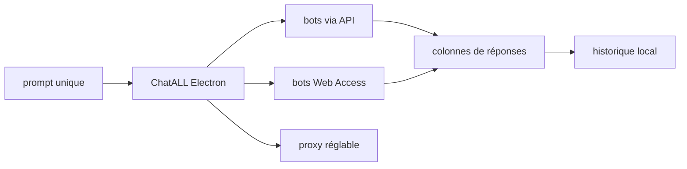

# ai-shifu/ChatALL

> Client de bureau qui envoie le même prompt à plusieurs bots IA en parallèle.

## Le problème
Comparer les réponses de plusieurs modèles oblige à ouvrir cinq onglets et à copier
le même prompt cinq fois.

## Ce que ça fait vraiment
Envoie un prompt simultanément à plusieurs bots et affiche les réponses côte à côte
en une, deux ou trois colonnes. Mode « quick-prompt » pour enchaîner sans attendre
la réponse précédente. Historique stocké en local, surlignage des bonnes réponses,
suppression des mauvaises, activation/désactivation de chaque bot, mode sombre,
raccourcis, chats multiples, gestion de prompts, réglage de proxy. Dix langues
d'interface, Windows / macOS / Linux.

## Comment c'est branché


## Essayer
```bash
brew install --cask chatall
npm install
npm run electron:serve
npm run electron:build
```

## Coût et pièges
C'est un client, pas un proxy : il faut vos propres comptes et jetons d'API pour
chaque bot. Télémétrie anonyme activée : quels bots sont sollicités, longueur du
prompt et de la réponse, réponses supprimées ou surlignées — contenus exclus.

## Ce que ce n'est pas
Pas une passerelle d'API unifiée ni un banc d'essai reproductible. Le README
prévient que les bots « Web Access » reposent sur du reverse engineering des
interfaces web, cassent souvent et sont instables : il recommande explicitement de
privilégier les bots à API.

## Alternatives
- ChatHub : cité comme l'inspiration du projet.

## Pour toi
Utile une soirée pour départager des modèles, pas un outil de travail. Ignorer.
